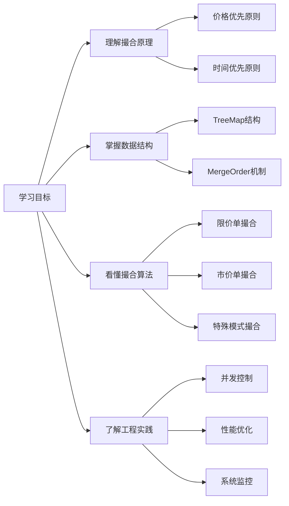
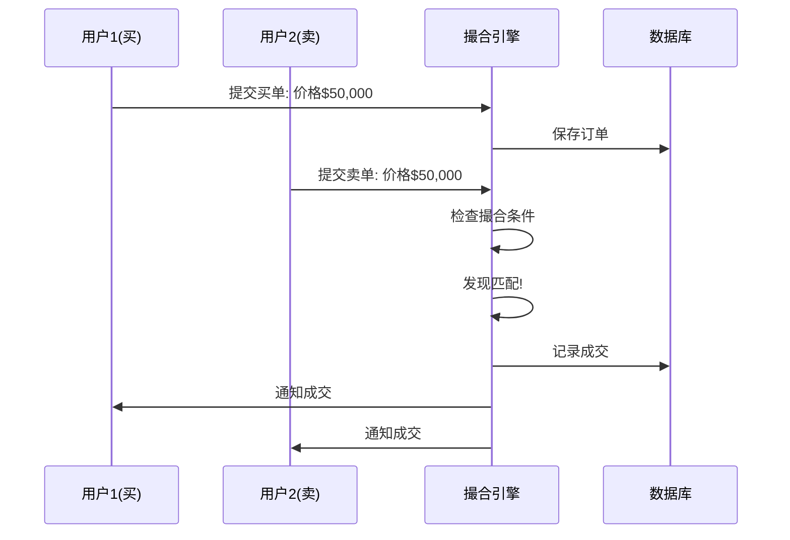
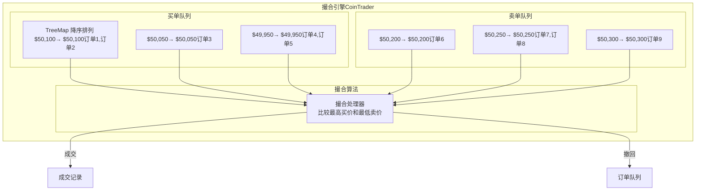
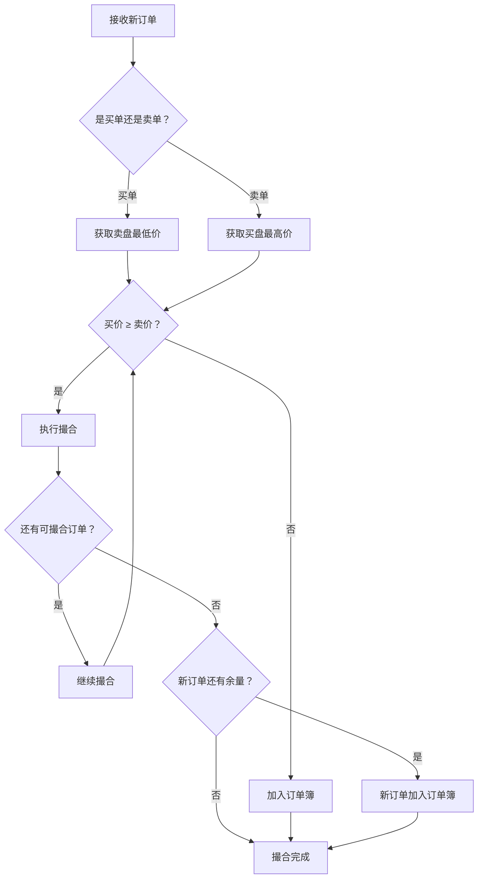
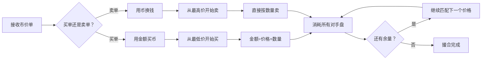

# 第 9 章：撮合引擎的核心算法和工程实践

## 引言

想象一下，你在一个繁忙的菜市场，有很多人在买苹果，也有很多人在卖苹果。如何公平地让买家和卖家成交呢？

**撮合引擎**就是这个菜市场的"智能管理员"。它的任务很简单：
- 优先让出价最高的买家买到苹果（**价格优先**）
- 如果出价相同，让先到的人先买到（**时间优先**）

但问题在于：可能有成千上万的买家卖家同时出现，如何快速、公平地处理所有人？这就是撮合引擎要解决的核心问题。

### 为什么撮合引擎如此重要？

撮合引擎是数字货币交易所的"心脏"，直接影响：
- **交易公平性**：确保每个人都能得到公平的撮合机会
- **系统性能**：决定交易所能处理多大的交易量
- **用户体验**：影响订单成交速度和价格准确性
- **平台收益**：高效的撮合能带来更多的交易手续费




---

## 9.1 撮合引擎基础概念

在深入技术实现之前，我们先用生活中的例子来理解撮合引擎的基本概念。

### 9.1.1 核心概念解析

#### 交易订单类型
**限价单（Limit Order）**：
- **生活例子**：你去菜市场说"我最多花10块钱买苹果"
- **特点**：指定价格，只有达到指定价格才能成交
- **优势**：价格可控，但可能无法立即成交

**市价单（Market Order）**：
- **生活例子**：你去菜市场说"按现在的价格买苹果，不管多少钱"
- **特点**：不指定价格，立即以最优价格成交
- **优势**：保证成交，但价格可能不理想

#### 订单簿（Order Book）
**概念说明**：记录所有未成交订单的账本

**生活例子**：想象一个公告板，左边写着"谁要买苹果，出多少钱"，右边写着"谁要卖苹果，要多少钱"

```
让我们用这个BTC/USDT订单簿来说明：

           卖盘（Ask）           买盘（Bid）
  价格        数量          价格        数量
  $50,100    0.5 BTC       $49,950    1.0 BTC
  $50,050    1.2 BTC       $49,900    2.0 BTC
  $50,000    0.8 BTC
```

理解要点：

  1. 卖盘（Ask）- 卖家的要求

    - $50,100：有人愿意用$50,100的价格卖0.5个BTC
    - $50,050：有人愿意用$50,050的价格卖1.2个BTC
    - $50,000：有人愿意用$50,000的价格卖0.8个BTC
  2. 买盘（Bid）- 买家的出价

    - $49,950：有人愿意用$49,950的价格买1.0个BTC
    - $49,900：有人愿意用$49,900的价格买2.0个BTC

  💡 如何理解"当前市价"？

  当前市价不是单一的价格，而是一个价格区间：

  最高买价：$49,950（买家愿意出的最高价格）
  最低卖价：$50,000（卖家愿意接受的最低价格）
                ↓
           这个差距叫"价差"

  为什么会这样？
  - 买家想便宜买，所以出价比卖家要价低
  - 卖家想贵卖，所以要价比买家出价高
  - 只有当买家出价 ≥ 卖家要价时，才能成交


  🔑 关键概念

  1. 价差（Spread）：最高买价和最低卖价之间的差距

    - 这里的价差是$50（$50,000 - $49,950）
  2. 市场深度：每个价格 level 上有多少数量

    - 深度越好，大单对价格冲击越小
  3. 流动性：订单簿中订单的多少

    - 订单越多，流动性越好，交易越容易


​    

### 9.1.2 撮合的基本原则

#### 价格优先原则
**规则**：出价最高的买家优先，要价最低的卖家优先

**数学表达**：

```
买单排序：P1 > P2 > P3  →  P1优先
卖单排序：S1 < S2 < S3  →  S1优先
```

#### 时间优先原则
**规则**：价格相同时，先下单的先成交

**生活例子**：两个人都出50块钱买苹果，先来的人先买到

### 9.1.3 撮合流程概览



---

## 9.2 订单簿数据结构设计

### 9.2.1 为什么选择TreeMap？

在撮合引擎中，我们需要快速找到：
- **买方的最高出价**（最大值）
- **卖方的最低要价**（最小值）

**TreeMap的优势**：
- **自动排序**：插入数据时自动按顺序排列
- **快速查找**：O(log N)的时间复杂度找到最大最小值
- **动态更新**：可以随时插入、删除订单

### 9.2.2 TreeMap撮合原理

#### 买单队列设计
```java
// 买单：价格从高到低排序（高价优先）
TreeMap<BigDecimal, MergeOrder> buyLimitPriceQueue
    = new TreeMap<>(Comparator.reverseOrder());
```

**为什么要反转排序？**
- TreeMap默认是升序排列（小→大）
- 买单需要降序排列（大→小），因为出价高的优先
- 使用`Comparator.reverseOrder()`实现降序

#### 卖单队列设计
```java
// 卖单：价格从低到高排序（低价优先）
TreeMap<BigDecimal, MergeOrder> sellLimitPriceQueue
    = new TreeMap<>(Comparator.naturalOrder());
```

### 9.2.3 数据结构可视化

让我们用一个具体的例子来理解TreeMap的结构：

**场景**：BTC/USDT交易对的订单簿

```
买单队列（TreeMap, 降序）：
Key(价格)    Value(MergeOrder)
$50,100  → [订单1: 1BTC, 订单2: 0.5BTC]
$50,050  → [订单3: 2BTC]
$49,950  → [订单4: 1.5BTC, 订单5: 0.8BTC]

卖单队列（TreeMap, 升序）：
$50,200  → [订单6: 1.2BTC]
$50,250  → [订单7: 0.8BTC, 订单8: 1BTC]
$50,300  → [订单9: 0.6BTC]
```

### 9.2.4 MergeOrder机制详解

#### 为什么需要MergeOrder？
**问题**：如果相同价格的订单很多，TreeMap的性能会下降

**解决方案**：MergeOrder将相同价格的订单合并管理

```java
public class MergeOrder {
    private List<ExchangeOrder> orders = new ArrayList<>();

    // 添加新订单
    public void add(ExchangeOrder order) {
        orders.add(order);
    }

    // 获取最早订单（时间优先）
    public ExchangeOrder peekFirst() {
        return orders.isEmpty() ? null : orders.get(0);
    }

    // 移除最早订单
    public void removeFirst() {
        if (!orders.isEmpty()) {
            orders.remove(0);
        }
    }
}
```

### 9.2.5 撮合引擎架构图



---

## 9.3 限价单撮合算法详解

### 9.3.1 撮合算法的核心逻辑

限价单撮合的本质是一个"匹配游戏"：

1. **找到最优价格**：买方最高价 vs 卖方最低价
2. **判断能否成交**：买价 ≥ 卖价？
3. **执行撮合**：如果能成交，处理订单和资金

### 9.3.2 撮合流程详解

让我们用一个具体的例子来理解撮合过程：

**初始状态**：
- 买方最高价：$50,000（订单A）
- 卖方最低价：$49,950（订单B）
- 可以成交！因为 $50,000 ≥ $49,950



### 9.3.3 成交价格确定规则

成交价格的确定原则：
- **限价单 vs 限价单**：以**先提交的订单价格**成交
- **限价单 vs 市价单**：以**限价单价格**成交
- **市价单 vs 市价单**：以**当前市价**成交

**生活例子**：
- 你出$50买苹果（限价单），别人要卖$49.9（限价单）
- 如果你的订单先提交，成交价是$50
- 如果对方的订单先提交，成交价是$49.9

### 9.3.4 撮合算法实现

```java
public void matchLimitPriceOrder(ExchangeOrder order) {
    // 1. 选择对手方订单簿
    TreeMap<BigDecimal, MergeOrder> opponentBook =
        order.getDirection() == ExchangeOrderDirection.BUY
        ? sellLimitPriceQueue  // 买单找卖盘
        : buyLimitPriceQueue;  // 卖单找买盘

    // 2. 开始撮合循环
    while (order.getTradedAmount() < order.getAmount()
           && !opponentBook.isEmpty()) {

        // 3. 获取最优价格
        BigDecimal bestPrice = opponentBook.firstKey();
        MergeOrder mergeOrder = opponentBook.get(bestPrice);

        // 4. 检查价格是否匹配
        if (!isPriceMatched(order, bestPrice)) {
            break; // 价格不匹配，停止撮合
        }

        // 5. 执行撮合
        executeMatch(order, mergeOrder, bestPrice);

        // 6. 清理已完全成交的订单
        if (mergeOrder.isEmpty()) {
            opponentBook.pollFirstEntry();
        }
    }

    // 7. 如果新订单还有余量，加入订单簿
    if (order.getTradedAmount() < order.getAmount()) {
        addToOrderBook(order);
    }
}
```

### 9.3.5 撮合过程示例

**场景**：
- 现有买单：$50,000 × 1 BTC（订单A）
- 新增卖单：$49,950 × 0.8 BTC（订单B）

**撮合过程**：

1. **价格检查**：$50,000 ≥ $49,950 ✓
2. **成交数量**：min(1, 0.8) = 0.8 BTC
3. **成交价格**：订单A先提交 → $50,000
4. **资金计算**：
   - 买家支付：0.8 × $50,000 = $40,000
   - 卖家收入：0.8 × $50,000 = $40,000
5. **订单状态**：
   - 订单A：还剩0.2 BTC未成交
   - 订单B：完全成交

---

## 9.4 市价单撮合算法

### 9.4.1 市价单的特点

市价单是"优先成交，不问价格"的订单类型：

**优势**：
- 保证成交：只要对手盘有订单就能成交
- 执行简单：不需要考虑价格匹配问题

**风险**：
- 价格滑点：大单可能影响市场价格
- 成本不确定：最终成交价可能超出预期

### 9.4.2 市价单撮合流程



### 9.4.3 市价买单算法

**原理**：用指定金额按从低到高的价格买入

```java
public void processMarketBuyOrder(ExchangeOrder order) {
    BigDecimal remainingAmount = order.getAmount(); // 剩余金额

    while (remainingAmount.compareTo(BigDecimal.ZERO) > 0
           && !sellLimitPriceQueue.isEmpty()) {

        // 1. 获取最低卖价
        BigDecimal bestSellPrice = sellLimitPriceQueue.firstKey();
        MergeOrder sellOrders = sellLimitPriceQueue.get(bestSellPrice);

        // 2. 计算可买入数量：金额 ÷ 价格
        BigDecimal canBuyAmount = remainingAmount.divide(bestSellPrice, 8, ROUND_DOWN);
        BigDecimal availableAmount = sellOrders.getTotalAmount();
        BigDecimal actualAmount = canBuyAmount.min(availableAmount);

        // 3. 执行撮合
        if (actualAmount.compareTo(BigDecimal.ZERO) > 0) {
            executeMarketTrade(order, sellOrders.peekFirst(), bestSellPrice, actualAmount);

            // 4. 更新剩余金额
            BigDecimal usedAmount = actualAmount.multiply(bestSellPrice);
            remainingAmount = remainingAmount.subtract(usedAmount);
        }
    }
}
```

### 9.4.4 市价单撮合示例

**场景**：
- 市价买单：用 $100,000 买BTC
- 卖盘情况：
  - $49,950 × 1 BTC
  - $50,000 × 1.5 BTC
  - $50,050 × 2 BTC

**撮合过程**：

1. **第一笔**：
   - 价格：$49,950
   - 数量：$100,000 ÷ $49,950 = 2.002 BTC
   - 可买：min(2.002, 1) = 1 BTC
   - 消耗：$49,950
   - 剩余：$100,000 - $49,950 = $50,050

2. **第二笔**：
   - 价格：$50,000
   - 数量：$50,050 ÷ $50,000 = 1.001 BTC
   - 可买：min(1.001, 1.5) = 1.001 BTC
   - 消耗：$50,000
   - 剩余：$50,050 - $50,000 = $50

3. **结果**：
   - 总买量：1 + 1.001 = 2.001 BTC
   - 剩余资金：$50（无法再买）
   - 平均成本：$100,000 ÷ 2.001 = $49,975.01/BTC


---

## 9.5 工程实践总结

### 9.5.1 撮合引擎的核心价值

撮合引擎不仅仅是一个算法，更是数字货币交易所的核心竞争力：

**技术价值**：
- **高频处理**：每秒处理数万笔订单
- **公平公正**：严格按照价格时间优先原则
- **低延迟**：微秒级撮合响应

**商业价值**：
- **用户体验**：快速成交、价格准确
- **平台收益**：高吞吐量带来更多手续费
- **竞争优势**：技术门槛保护市场份额

---

## 本章小结

通过本章的学习，我们深入理解了撮合引擎的核心原理和实现方法：

### 核心收获

1. **撮合原理**：
   - 掌握了价格优先、时间优先的基本原则
   - 理解了限价单和市价单的不同处理逻辑
   - 学会了订单簿的维护和查询方法
2. **数据结构**：
   - TreeMap实现高效的订单排序
   - MergeOrder优化相同价格订单管理
   - 内存数据结构的高性能设计
3. **算法实现**：
   - 限价单撮合的完整流程
   - 市价单的价格滑点处理
   - 特殊交易模式的撮合逻辑


撮合引擎的设计和实现是一个复杂的系统工程，需要在性能、可靠性、公平性之间找到最佳平衡。希望本章的内容能帮助你构建出优秀的撮合引擎系统。