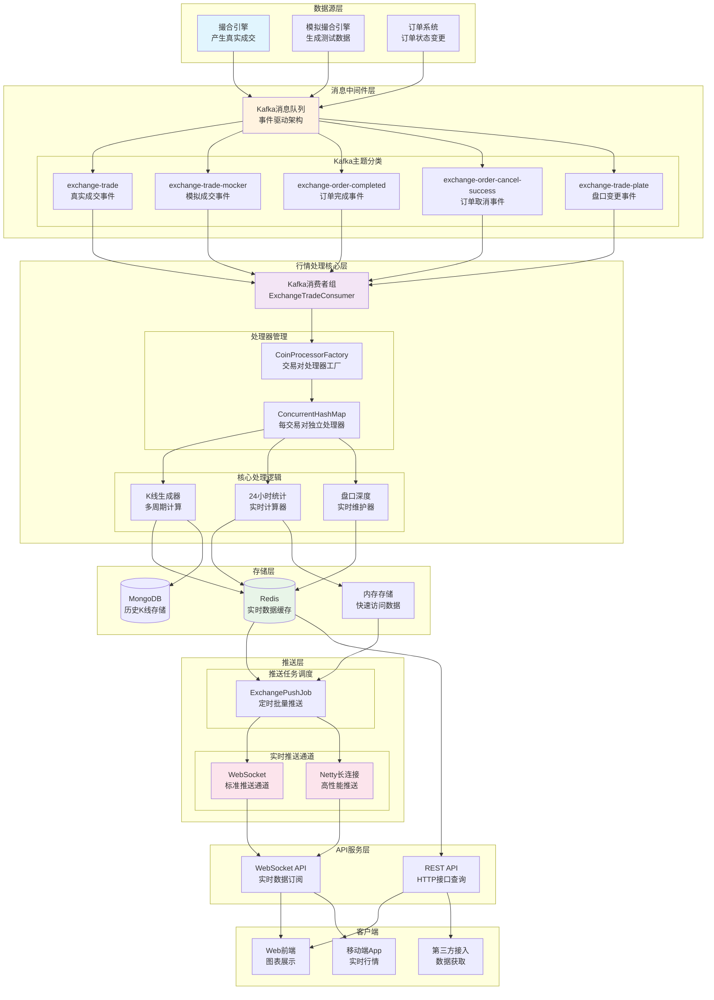
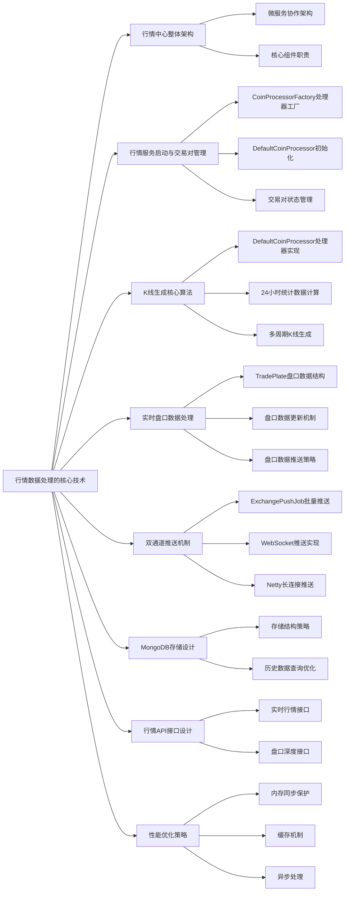
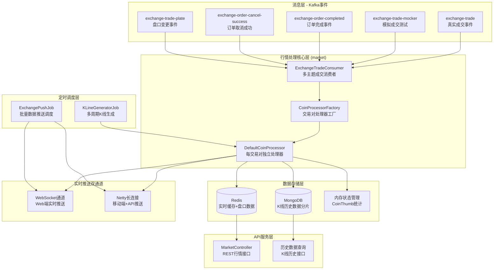
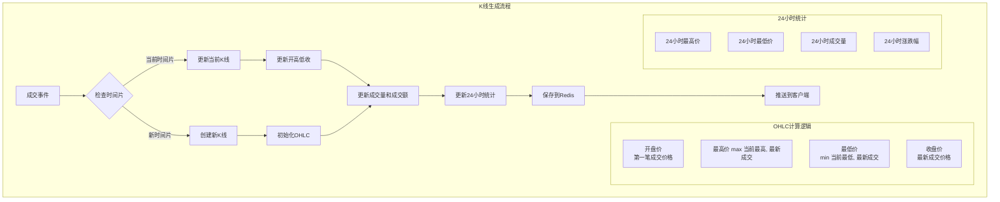
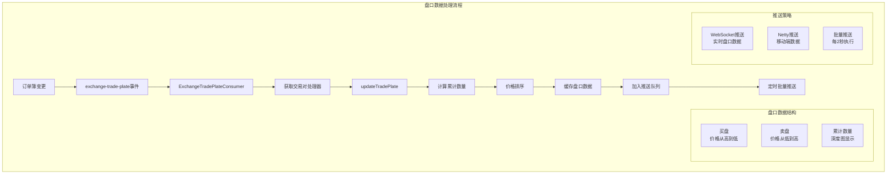

# 第 10 章：行情数据处理的核心技术

## 引言

在数字货币交易所的喧嚣世界中，每时每刻都在发生着大量的交易。撮合引擎完成订单匹配后，产生的原始成交记录就像一盘散沙，普通用户很难从中看出端倪。用户真正关心的是价格走势、成交量变化、市场热度等直观信息。

行情中心就如同一位专业的市场分析师，将海量的原始交易数据整理成清晰的K线图、深度图和统计指标。它不仅要处理实时数据流，还要维护历史记录，为用户提供完整的市场视图。

Bizzan的行情服务采用了事件驱动的架构设计，通过Kafka消费成交事件，实时生成多种周期的K线数据，维护24小时统计指标，并利用WebSocket和Netty双通道将信息及时推送给全球用户。

## 行情数据处理全局业务流程



### 核心技术挑战

| 技术挑战 | 解决方案 | 性能指标 |
|----------|----------|----------|
| **高并发数据处理** | 多处理器+异步处理 | 支持10万+TPS |
| **多周期K线生成** | 时间窗口算法+内存缓存 | 1分钟/5分钟/15分钟/1小时 |
| **实时推送延迟** | 双通道架构+批量优化 | 毫秒级延迟 <100ms |
| **大数据存储** | Redis+MongoDB分层存储 | 支持TB级历史数据 |
| **系统容错** | 事件驱动+幂等设计 | 故障自动恢复 |


通过本章的学习，你将掌握实时行情数据处理的核心技术，学会构建一个高效、实时的数据处理系统。



---

## 10.1 行情中心整体架构

在深入行情数据处理之前，我们需要理解几个核心概念：

**K线数据**：显示特定时间周期内价格走势的图表数据，包括开盘价、最高价、最低价、收盘价等。

**实时行情推送**：通过WebSocket等技术实时将市场数据推送给客户端，延迟要求毫秒级。

**盘口深度**：显示当前买盘和卖盘的价格和数量信息，反映市场流动性。

**成交明细**：记录每一笔交易的价格、数量、时间等信息。

**Tick数据**：最细粒度的行情数据，记录每次价格变动。

**批量处理**：将多个数据项合并处理，提高系统性能。

### 10.1.1 微服务协作架构

行情中心采用事件驱动的微服务架构，通过Kafka消息队列实现与撮合引擎的解耦：



### 10.1.2 核心组件职责

**ExchangeTradeConsumer 成交消费者**：

行情中心的核心是实时处理成交事件，将其转换为用户可以理解的K线数据。让我们看看行情服务是如何监听和处理成交事件的：

在成交数据的处理流程中，ExchangeTradeConsumer承担着关键的数据分发职责。它监听多个Kafka主题，处理不同类型的交易事件：

```java
@Component
@Slf4j
public class ExchangeTradeConsumer {
    private ExecutorService executor = new ThreadPoolExecutor(30, 100, 0L, TimeUnit.MILLISECONDS,
            new LinkedBlockingQueue<Runnable>(1024), new ThreadPoolExecutor.AbortPolicy());

    // 主要成交事件处理
    @KafkaListener(topics = "exchange-trade", containerFactory = "kafkaListenerContainerFactory")
    public void handleTrade(List<ConsumerRecord<String, String>> records) {
        for (int i = 0; i < records.size(); i++) {
            ConsumerRecord<String, String> record = records.get(i);
            executor.submit(new HandleTradeThread(record));
        }
    }

    // 处理模拟交易数据
    @KafkaListener(topics = "exchange-trade-mocker", containerFactory = "kafkaListenerContainerFactory")
    public void handleMockerTrade(List<ConsumerRecord<String, String>> records) {
        try {
            for (int i = 0; i < records.size(); i++) {
                ConsumerRecord<String, String> record = records.get(i);
                List<ExchangeTrade> trades = JSON.parseArray(record.value(), ExchangeTrade.class);
                String symbol = trades.get(0).getSymbol();
                CoinProcessor coinProcessor = coinProcessorFactory.getProcessor(symbol);
                if (coinProcessor != null) {
                    coinProcessor.process(trades);
                }
                pushJob.addTrades(symbol, trades);
            }
        } catch (Exception e) {
            e.printStackTrace();
        }
    }

    // 处理订单完成事件
    @KafkaListener(topics = "exchange-order-completed", containerFactory = "kafkaListenerContainerFactory")
    public void handleOrderCompleted(List<ConsumerRecord<String, String>> records) {
        try {
            for (int i = 0; i < records.size(); i++) {
                ConsumerRecord<String, String> record = records.get(i);
                List<ExchangeOrder> orders = JSON.parseArray(record.value(), ExchangeOrder.class);
                for (ExchangeOrder order : orders) {
                    String symbol = order.getSymbol();
                    exchangeOrderService.tradeCompleted(order.getOrderId(), order.getTradedAmount(), order.getTurnover());
                    messagingTemplate.convertAndSend("/topic/market/order-completed/" + symbol + "/" + order.getMemberId(), order);
                    nettyHandler.handleOrder(NettyCommand.PUSH_EXCHANGE_ORDER_COMPLETED, order);
                }
            }
        } catch (Exception e) {
            e.printStackTrace();
        }
    }

    // 异步处理成交线程
    public class HandleTradeThread implements Runnable {
        private ConsumerRecord<String, String> record;

        @Override
        public void run() {
            try {
                List<ExchangeTrade> trades = JSON.parseArray(record.value(), ExchangeTrade.class);
                String symbol = trades.get(0).getSymbol();
                CoinProcessor coinProcessor = coinProcessorFactory.getProcessor(symbol);

                for (ExchangeTrade trade : trades) {
                    // 处理成交明细
                    exchangeOrderService.processExchangeTrade(trade, secondReferrerAward);

                    // 推送订单成交订阅给买卖双方
                    ExchangeOrder buyOrder = exchangeOrderService.findOne(trade.getBuyOrderId());
                    ExchangeOrder sellOrder = exchangeOrderService.findOne(trade.getSellOrderId());

                    messagingTemplate.convertAndSend("/topic/market/order-trade/" + symbol + "/" + buyOrder.getMemberId(), buyOrder);
                    messagingTemplate.convertAndSend("/topic/market/order-trade/" + symbol + "/" + sellOrder.getMemberId(), sellOrder);

                    nettyHandler.handleOrder(NettyCommand.PUSH_EXCHANGE_ORDER_TRADE, buyOrder);
                    nettyHandler.handleOrder(NettyCommand.PUSH_EXCHANGE_ORDER_TRADE, sellOrder);
                }

                // 处理K线行情
                if (coinProcessor != null) {
                    coinProcessor.process(trades);
                }
                pushJob.addTrades(symbol, trades);
            } catch (Exception e) {
                e.printStackTrace();
            }
        }
    }
}
```

**实际运行机制**：

- **5主题全监听**：同时监听5个Kafka主题，覆盖完整交易生命周期
  - `exchange-trade`：真实成交事件，触发K线更新和推送
  - `exchange-trade-mocker`：模拟成交数据，支持测试环境
  - `exchange-order-completed`：订单完成通知，更新用户订单状态
  - `exchange-order-cancel-success`：订单取消成功，清理相关状态
  - `exchange-trade-plate`：盘口变更事件，更新深度图数据

- **线程池并发处理**：30-100个线程动态扩容，使用LinkedBlockingQueue缓冲，拒绝策略确保系统稳定性

- **双通道推送保障**：WebSocket和Netty并行推送，确保不同客户端都能及时收到数据

- **异常隔离设计**：每个Kafka监听器独立异常处理，单个主题故障不影响其他主题的数据处理

- **处理器工厂模式**：通过CoinProcessorFactory管理每个交易对的DefaultCoinProcessor实例，实现数据隔离和并发处理

了解了行情中心的整体架构后，我们来看一个关键的基础问题：行情服务是如何启动的，以及如何管理多个交易对的处理器。这是整个行情系统稳定运行的基础。

---

## 10.2 行情服务启动与交易对管理

在深入K线生成算法之前，我们需要了解行情服务是如何启动的，以及如何管理多个交易对的处理器。

### 10.2.1 CoinProcessorFactory 处理器工厂

CoinProcessorFactory是行情服务的核心管理组件，负责创建和管理每个交易对的处理器实例：

```java
@Component
public class CoinProcessorFactory {
    @Autowired
    private ExchangeCoinService coinService;

    @Autowired
    private CoinExchangeRate coinExchangeRate;

    private Map<String, CoinProcessor> processorMap = new ConcurrentHashMap<>();

    // 初始化所有交易对处理器
    @PostConstruct
    public void init() {
        List<ExchangeCoin> coins = coinService.findAllEnabled();
        for (ExchangeCoin coin : coins) {
            createProcessor(coin);
        }
        logger.info("CoinProcessorFactory initialized with {} processors", processorMap.size());
    }

    // 创建单个交易对处理器
    private void createProcessor(ExchangeCoin coin) {
        String symbol = coin.getSymbol();
        DefaultCoinProcessor processor = new DefaultCoinProcessor(
            symbol,                    // 交易对符号
            coin.getBaseVolume(),      // 基础币种
            coinExchangeRate          // 汇率服务
        );

        // 初始化处理器状态
        processor.init();
        processorMap.put(symbol, processor);

        logger.info("Created processor for symbol: {}", symbol);
    }

    // 获取交易对处理器
    public CoinProcessor getProcessor(String symbol) {
        return processorMap.get(symbol);
    }

    // 获取所有处理器
    public Map<String, CoinProcessor> getProcessorMap() {
        return processorMap;
    }

    // 动态添加新交易对
    public void addProcessor(ExchangeCoin coin) {
        if (!processorMap.containsKey(coin.getSymbol())) {
            createProcessor(coin);
        }
    }

    // 移除交易对处理器
    public void removeProcessor(String symbol) {
        CoinProcessor processor = processorMap.remove(symbol);
        if (processor != null) {
            processor.stop();  // 停止处理器
            logger.info("Removed processor for symbol: {}", symbol);
        }
    }
}
```

**工厂管理特点**：

- **ConcurrentHashMap**：线程安全的处理器映射
- **动态管理**：支持运行时添加/移除交易对
- **自动初始化**：启动时自动创建所有启用的交易对处理器
- **生命周期管理**：控制处理器的启动和停止

### 10.2.2 DefaultCoinProcessor 初始化

每个交易对处理器的初始化过程：

```java
public class DefaultCoinProcessor implements CoinProcessor {
    private String symbol;
    private String baseCoin;
    private KLine currentKLine;
    private CoinThumb coinThumb;
    private Boolean isHalt = true;
    private Boolean stopKLine = false;

    // 处理器初始化
    public void init() {
        logger.info("Initializing DefaultCoinProcessor for symbol: {}", symbol);

        // 创建24小时统计对象
        this.coinThumb = new CoinThumb();
        this.coinThumb.setSymbol(symbol);
        this.coinThumb.setBaseCoin(baseCoin);
        this.coinThumb.setTime(System.currentTimeMillis());

        // 创建当前K线对象
        createNewKLine();

        // 从数据库恢复24小时统计数据
        restoreThumbFromDB();

        // 从数据库恢复当前K线状态
        restoreCurrentKLineFromDB();

        // 启动处理器
        this.isHalt = false;

        logger.info("DefaultCoinProcessor initialized successfully for symbol: {}", symbol);
    }

    // 从数据库恢复24小时统计
    private void restoreThumbFromDB() {
        try {
            // 查询最近的K线用于恢复统计
            List<KLine> recentKLines = marketService.findRecentKLines(symbol, "1day", 1);
            if (!recentKLines.isEmpty()) {
                KLine lastDayKLine = recentKLines.get(0);
                coinThumb.setLastDayClose(lastDayKLine.getClosePrice());
                coinThumb.setOpen(lastDayKLine.getOpenPrice());
                coinThumb.setHigh(lastDayKLine.getHighestPrice());
                coinThumb.setLow(lastDayKLine.getLowestPrice());
                coinThumb.setClose(lastDayKLine.getClosePrice());
                coinThumb.setVolume(lastDayKLine.getVolume());
                coinThumb.setTurnover(lastDayKLine.getTurnover());
            }
        } catch (Exception e) {
            logger.error("Failed to restore thumb from DB for symbol: {}", symbol, e);
        }
    }

    // 停止处理器
    public void stop() {
        logger.info("Stopping DefaultCoinProcessor for symbol: {}", symbol);
        this.isHalt = true;
        // 持久化当前状态
        persistCurrentState();
    }
}
```

**初始化特点**：

- **状态恢复**：从MongoDB恢复24小时统计和当前K线状态
- **容错处理**：初始化失败时的降级策略
- **状态持久化**：停止时保存当前状态确保数据连续性

### 10.2.3 交易对状态管理

行情服务支持动态的交易对管理：

```java
@RestController
@RequestMapping("/admin/market")
public class MarketAdminController {
    @Autowired
    private CoinProcessorFactory processorFactory;

    @Autowired
    private ExchangeCoinService coinService;

    // 启用交易对
    @PostMapping("/symbol/{symbol}/enable")
    public MessageResult enableSymbol(@PathVariable String symbol) {
        ExchangeCoin coin = coinService.findBySymbol(symbol);
        if (coin == null) {
            return error("Symbol not found");
        }

        coin.setStatus(ExchangeCoinStatusEnum.ONLINE);
        coinService.save(coin);

        // 添加到处理器工厂
        processorFactory.addProcessor(coin);

        return success("Symbol enabled successfully");
    }

    // 禁用交易对
    @PostMapping("/symbol/{symbol}/disable")
    public MessageResult disableSymbol(@PathVariable String symbol) {
        ExchangeCoin coin = coinService.findBySymbol(symbol);
        if (coin == null) {
            return error("Symbol not found");
        }

        coin.setStatus(ExchangeCoinStatusEnum.OFFLINE);
        coinService.save(coin);

        // 从处理器工厂移除
        processorFactory.removeProcessor(symbol);

        return success("Symbol disabled successfully");
    }

    // 获取处理器状态
    @GetMapping("/processor/{symbol}/status")
    public MessageResult getProcessorStatus(@PathVariable String symbol) {
        CoinProcessor processor = processorFactory.getProcessor(symbol);
        if (processor == null) {
            return error("Processor not found");
        }

        Map<String, Object> status = new HashMap<>();
        status.put("symbol", symbol);
        status.put("isHalt", processor.isHalt());
        status.put("stopKLine", processor.isStopKline());
        status.put("currentKLineTime", processor.getCurrentKLine().getTime());
        status.put("thumbOpen", processor.getThumb().getOpen());
        status.put("thumbClose", processor.getThumb().getClose());

        return success(status);
    }
}
```

了解了交易对管理机制后，我们就可以深入核心的K线生成算法了。这是行情系统最核心的功能，负责将原始的成交数据转换为用户可以理解的技术分析图表数据。

---

## 10.3 K 线生成核心算法

### K线生成算法流程图



### 多周期K线生成策略

| K线周期 | 生成策略 | 数据用途 | 存储位置 |
|----------|----------|----------|----------|
| **1分钟** | 实时生成，每分钟切换 | 短线交易分析 | Redis + MongoDB |
| **5分钟** | 基于1分钟聚合 | 中短期分析 | MongoDB |
| **15分钟** | 基于1分钟聚合 | 中期趋势分析 | MongoDB |
| **1小时** | 基于1分钟聚合 | 长线趋势分析 | MongoDB |
| **4小时** | 基于1小时聚合 | 超长期分析 | MongoDB |
| **1天** | 基于1小时聚合 | 日级别分析 | MongoDB |

### K线数据字段说明

| 字段名 | 数据类型 | 含义 | 计算方式 |
|--------|----------|------|----------|
| **openPrice** | BigDecimal | 开盘价 | 时间片第一笔成交价格 |
| **highestPrice** | BigDecimal | 最高价 | 时间片内成交价格最大值 |
| **lowestPrice** | BigDecimal | 最低价 | 时间片内成交价格最小值 |
| **closePrice** | BigDecimal | 收盘价 | 时间片最后一笔成交价格 |
| **volume** | BigDecimal | 成交量 | 时间片内成交数量累加 |
| **turnover** | BigDecimal | 成交额 | 时间片内成交金额累加 |
| **count** | Integer | 成交笔数 | 时间片内成交次数统计 |
| **time** | Long | 时间戳 | K线时间片开始时间 |
| **period** | String | 周期标识 | "1min", "5min", "1h" 等 |

### 10.3.1 DefaultCoinProcessor 处理器实现

在交易数据处理的核心环节，DefaultCoinProcessor负责将单笔成交转换为有意义的K线数据。每个交易对都有一个独立的处理器实例，确保不同币种的数据处理互不干扰：

```java
@ToString
public class DefaultCoinProcessor implements CoinProcessor {
    private String symbol;
    private String baseCoin;
    private KLine currentKLine;    // 当前时间片的K线
    private CoinThumb coinThumb;   // 24小时统计数据
    private Boolean isHalt = true; // 是否暂停处理
    private Boolean stopKLine = false; // 是否停止K线生成

    @Override
    public void process(List<ExchangeTrade> trades) {
        if (!isHalt && trades != null && trades.size() > 0) {
            synchronized (currentKLine) {
                for (ExchangeTrade exchangeTrade : trades) {
                    // 处理K线数据 - 实时更新OHLC
                    processTrade(currentKLine, exchangeTrade);
                    // 处理今日概况信息 - 24小时统计
                    handleThumb(exchangeTrade);
                    // 存储并推送成交信息 - 历史数据保存
                    handleTradeStorage(exchangeTrade);
                }
            }
        }
    }

    // K线数据处理核心算法
    public void processTrade(KLine kLine, ExchangeTrade exchangeTrade) {
        if (kLine.getClosePrice().compareTo(BigDecimal.ZERO) == 0) {
            // 第一笔成交设置K线基础值
            kLine.setOpenPrice(exchangeTrade.getPrice());
            kLine.setHighestPrice(exchangeTrade.getPrice());
            kLine.setLowestPrice(exchangeTrade.getPrice());
            kLine.setClosePrice(exchangeTrade.getPrice());
        } else {
            // 更新最高价和最低价
            kLine.setHighestPrice(exchangeTrade.getPrice().max(kLine.getHighestPrice()));
            kLine.setLowestPrice(exchangeTrade.getPrice().min(kLine.getLowestPrice()));
            kLine.setClosePrice(exchangeTrade.getPrice());
        }

        kLine.setCount(kLine.getCount() + 1);
        kLine.setVolume(kLine.getVolume().add(exchangeTrade.getAmount()));

        BigDecimal turnover = exchangeTrade.getPrice().multiply(exchangeTrade.getAmount());
        kLine.setTurnover(kLine.getTurnover().add(turnover));
    }

    // 创建新的K线时间片
    public void createNewKLine() {
        currentKLine = new KLine();
        synchronized (currentKLine) {
            Calendar calendar = Calendar.getInstance();
            calendar.set(Calendar.SECOND, 0);
            calendar.set(Calendar.MILLISECOND, 0);
            // 1分钟K线要是下一个整分钟的
            calendar.add(Calendar.MINUTE, 1);
            currentKLine.setTime(calendar.getTimeInMillis());
            currentKLine.setPeriod("1min");
            currentKLine.setCount(0);
        }
    }
}
```

**K 线生成原理**：

1. **开高低收计算**：实时更新 OHLC 四个价格
2. **成交量累加**：每笔成交的 amount 和 turnover 累加
3. **时间片管理**：每个时间片维护独立的 K 线对象
4. **原子操作**：通过 synchronized 保证数据一致性

### 10.3.2 24 小时统计数据计算

```java
// 24小时统计数据处理 - 基于实际代码实现
public void handleThumb(ExchangeTrade exchangeTrade) {
    logger.info("handleThumb symbol = {}", this.symbol);
    synchronized (coinThumb) {
        if (coinThumb.getOpen().compareTo(BigDecimal.ZERO) == 0) {
            // 第一笔交易记为开盘价
            coinThumb.setOpen(exchangeTrade.getPrice());
        }

        // 更新最高价
        coinThumb.setHigh(exchangeTrade.getPrice().max(coinThumb.getHigh()));

        // 更新最低价
        if (coinThumb.getLow().compareTo(BigDecimal.ZERO) == 0) {
            coinThumb.setLow(exchangeTrade.getPrice());
        } else {
            coinThumb.setLow(exchangeTrade.getPrice().min(coinThumb.getLow()));
        }

        // 更新最新价
        coinThumb.setClose(exchangeTrade.getPrice());

        // 累计成交量和成交额
        coinThumb.setVolume(coinThumb.getVolume().add(exchangeTrade.getAmount()).setScale(4, RoundingMode.UP));
        BigDecimal turnover = exchangeTrade.getPrice().multiply(exchangeTrade.getAmount()).setScale(4, RoundingMode.UP);
        coinThumb.setTurnover(coinThumb.getTurnover().add(turnover));

        // 计算涨跌幅
        BigDecimal change = coinThumb.getClose().subtract(coinThumb.getOpen());
        coinThumb.setChange(change);
        if (coinThumb.getLow().compareTo(BigDecimal.ZERO) > 0) {
            coinThumb.setChg(change.divide(coinThumb.getLow(), 4, BigDecimal.ROUND_UP));
        }

        // 处理美元汇率计算
        if ("USDT".equalsIgnoreCase(baseCoin)) {
            coinThumb.setUsdRate(exchangeTrade.getPrice());
        }
        coinThumb.setBaseUsdRate(coinExchangeRate.getUsdRate(baseCoin));
        coinThumb.setUsdRate(exchangeTrade.getPrice().multiply(coinExchangeRate.getUsdRate(baseCoin)));
    }
}

// 每日重置统计数据 - 基于0点重置机制
@Override
public void resetThumb() {
    logger.info("reset coinThumb for {}", symbol);
    synchronized (coinThumb) {
        // 保留当前收盘价作为昨收价
        BigDecimal currentClose = coinThumb.getClose();

        // 重置24小时统计数据
        coinThumb.setOpen(BigDecimal.ZERO);
        coinThumb.setHigh(BigDecimal.ZERO);
        coinThumb.setLow(BigDecimal.ZERO);
        coinThumb.setClose(BigDecimal.ZERO);
        coinThumb.setVolume(BigDecimal.ZERO);
        coinThumb.setTurnover(BigDecimal.ZERO);
        coinThumb.setChg(BigDecimal.ZERO);
        coinThumb.setChange(BigDecimal.ZERO);

        // 设置昨收价用于计算隔夜涨跌
        coinThumb.setLastDayClose(currentClose);

        // 重置时间戳
        coinThumb.setTime(System.currentTimeMillis());
    }
}
```

**统计计算特点**：

- **实时更新**：每笔成交都会触发统计数据更新
- **汇率集成**：实时计算美元汇率，支持USDT直接映射
- **精度控制**：使用 RoundingMode.UP 控制计算精度
- **日终重置**：通过resetThumb()方法在每日0点重置统计
- **昨收价保存**：重置时保留前日收盘价用于计算隔夜涨跌

### 10.3.3 多周期 K 线生成

基于 `market/src/main/java/com/bizzan/bitrade/job/KLineGeneratorJob.java` 的定时任务分析：

```java
@Component
public class KLineGeneratorJob {

    // 分钟级K线生成
    @Scheduled(cron = "0 * * * * *")
    public void handle5minKLine() {
        Calendar calendar = Calendar.getInstance();
        calendar.set(Calendar.SECOND, 0);
        calendar.set(Calendar.MILLISECOND, 0);
        long time = calendar.getTimeInMillis();
        int minute = calendar.get(Calendar.MINUTE);

        processorFactory.getProcessorMap().forEach((symbol, processor) -> {
            if (!processor.isStopKline()) {
                // 生成1分钟K线
                processor.autoGenerate();
                // 更新24H成交量
                processor.update24HVolume(time);

                // 根据分钟数生成不同周期的K线
                if (minute % 5 == 0) {
                    processor.generateKLine(5, Calendar.MINUTE, time);
                }
                if (minute % 15 == 0) {
                    processor.generateKLine(15, Calendar.MINUTE, time);
                }
                if (minute % 30 == 0) {
                    processor.generateKLine(30, Calendar.MINUTE, time);
                }
            }
        });
    }

    // 小时级K线生成
    @Scheduled(cron = "0 0 * * * *")
    public void handleHourKLine() {
        processorFactory.getProcessorMap().forEach((symbol, processor) -> {
            if (!processor.isStopKline()) {
                Calendar calendar = Calendar.getInstance();
                calendar.set(Calendar.MINUTE, 0);
                calendar.set(Calendar.SECOND, 0);
                calendar.set(Calendar.MILLISECOND, 0);
                long time = calendar.getTimeInMillis();

                processor.generateKLine(1, Calendar.HOUR_OF_DAY, time);
            }
        });
    }

    // 日级K线生成
    @Scheduled(cron = "0 0 0 * * *")
    public void handleDayKLine() {
        processorFactory.getProcessorMap().forEach((symbol, processor) -> {
            if (!processor.isStopKline()) {
                Calendar calendar = Calendar.getInstance();
                calendar.set(Calendar.HOUR_OF_DAY, 0);
                calendar.set(Calendar.MINUTE, 0);
                calendar.set(Calendar.SECOND, 0);
                calendar.set(Calendar.MILLISECOND, 0);
                long time = calendar.getTimeInMillis();

                // 生成日K线、周K线、月K线
                processor.generateKLine(1, Calendar.DAY_OF_YEAR, time);

                // 每周和每月的第一个交易日生成周K线和月K线
                int week = calendar.get(Calendar.DAY_OF_WEEK);
                int dayOfMonth = calendar.get(Calendar.DAY_OF_MONTH);

                if (week == 1) {
                    processor.generateKLine(1, Calendar.DAY_OF_WEEK, time);
                }
                if (dayOfMonth == 1) {
                    processor.generateKLine(1, Calendar.DAY_OF_MONTH, time);
                }
            }
        });
    }
}
```

**多周期生成策略**：

- **1 分钟**：每分钟自动生成
- **5/15/30 分钟**：按分钟整点生成
- **1 小时**：每小时整点生成
- **1 天/周/月**：每天 0 点生成

除了K线数据外，实时盘口数据也是行情系统的重要组成部分。盘口数据显示当前市场的买卖盘情况，为用户提供市场深度信息，是交易决策的重要参考。

---

## 10.4 实时盘口数据处理

### 盘口数据处理流程图



### 盘口深度档位配置

| 档位数 | 用途 | 显示精度 | 适用场景 | 推送频率 |
|--------|------|----------|----------|----------|
| **24档** | Web端显示 | 标准精度 | 普通用户 | 2秒 |
| **50档** | 专业深度图 | 高精度 | 专业交易员 | 2秒 |
| **全档位** | API接口 | 完整深度 | 机构客户 | 按需 |

### 盘口数据字段对比

| 字段 | 买盘(ASK) | 卖盘(BID) | 计算规则 | 显示用途 |
|------|-----------|-----------|----------|----------|
| **price** | 价格从低到高 | 价格从高到低 | 订单价格 | 横轴价格显示 |
| **amount** | 该价位挂单量 | 该价位挂单量 | 直接取值 | 纵轴深度显示 |
| **totalAmount** | 累计挂单量 | 累计挂单量 | 向外累加 | 深度面积图 |
| **direction** | BUY | SELL | 订单方向 | 区分买卖盘 |


### 10.4.1 TradePlate 盘口数据结构

盘口深度数据是行情系统的重要组成部分，显示当前市场的买卖盘情况：

```java
@Data
public class TradePlate {
    private String symbol;                // 交易对
    private ExchangeOrderDirection direction; // 方向（买/卖）
    private List<TradePlateItem> items;   // 盘口项目列表
    private Long time;                    // 更新时间
}

@Data
public class TradePlateItem {
    private BigDecimal price;             // 价格
    private BigDecimal amount;            // 数量
    private BigDecimal totalAmount;       // 累计数量（用于深度图显示）
}

// 盘口数据处理器
@Component
public class ExchangeTradePlateConsumer {

    @KafkaListener(topics = "exchange-trade-plate", containerFactory = "kafkaListenerContainerFactory")
    public void handleTradePlate(List<ConsumerRecord<String, String>> records) {
        try {
            for (ConsumerRecord<String, String> record : records) {
                TradePlate plate = JSON.parseObject(record.value(), TradePlate.class);
                String symbol = plate.getSymbol();

                // 获取对应交易对的处理器
                CoinProcessor processor = coinProcessorFactory.getProcessor(symbol);
                if (processor != null) {
                    processor.updateTradePlate(plate);
                }

                // 添加到推送队列
                pushJob.addPlates(symbol, plate);
            }
        } catch (Exception e) {
            logger.error("Error processing trade plate", e);
        }
    }
}
```

### 10.4.2 盘口数据更新机制

```java
// DefaultCoinProcessor中的盘口更新方法
public void updateTradePlate(TradePlate plate) {
    if (plate == null || plate.getItems() == null) {
        return;
    }

    // 计算累计数量用于深度图显示
    List<TradePlateItem> items = plate.getItems();
    BigDecimal cumulativeAmount = BigDecimal.ZERO;

    for (TradePlateItem item : items) {
        cumulativeAmount = cumulativeAmount.add(item.getAmount());
        item.setTotalAmount(cumulativeAmount);
    }

    // 更新处理器中的盘口状态
    this.currentTradePlate = plate;

    logger.debug("Updated trade plate for symbol: {}, direction: {}, items count: {}",
        symbol, plate.getDirection(), items.size());
}

// 盘口数据排序
public List<TradePlateItem> sortPlateItems(List<TradePlateItem> items, ExchangeOrderDirection direction) {
    if (direction == ExchangeOrderDirection.BUY) {
        // 买盘按价格从高到低排序
        items.sort((a, b) -> b.getPrice().compareTo(a.getPrice()));
    } else {
        // 卖盘按价格从低到高排序
        items.sort((a, b) -> a.getPrice().compareTo(b.getPrice()));
    }
    return items;
}
```

**盘口数据处理特点**：

- **实时更新**：每次订单簿变化都会推送新的盘口数据
- **累计计算**：计算累计数量用于深度图可视化
- **双向排序**：买盘降序，卖盘升序
- **多档位支持**：支持24档、50档等多种深度显示

### 10.4.3 盘口数据推送策略

```java
// 在ExchangePushJob中的盘口推送逻辑
@Scheduled(fixedDelay = 2000) // 每2秒推送一次盘口数据
public void pushPlate() {
    Iterator<Map.Entry<String, List<TradePlate>>> entryIterator = plateQueue.entrySet().iterator();

    while (entryIterator.hasNext()) {
        Map.Entry<String, List<TradePlate>> entry = entryIterator.next();
        String symbol = entry.getKey();
        List<TradePlate> plates = entry.getValue();

        if (plates.size() > 0) {
            synchronized (plates) {
                boolean hasPushedAskPlate = false;
                boolean hasPushedBidPlate = false;

                for (TradePlate plate : plates) {
                    // 避免重复推送同一方向的盘口
                    if (plate.getDirection() == ExchangeOrderDirection.BUY && !hasPushedBidPlate) {
                        hasPushedBidPlate = true;
                    } else if (plate.getDirection() == ExchangeOrderDirection.SELL && !hasPushedAskPlate) {
                        hasPushedAskPlate = true;
                    } else {
                        continue; // 跳过重复推送
                    }

                    // WebSocket推送24档盘口
                    messagingTemplate.convertAndSend("/topic/market/trade-plate/" + symbol, plate.toJSON(24));

                    // WebSocket推送50档深度
                    messagingTemplate.convertAndSend("/topic/market/trade-depth/" + symbol, plate.toJSON(50));

                    // Netty推送盘口数据
                    nettyHandler.handlePlate(symbol, plate);
                }

                plates.clear(); // 清空已推送的数据
            }
        }
    }
}
```

K线数据和盘口数据都生成后，下一个关键问题是如何将这些实时数据快速、可靠地推送给全球的用户。Bizzan采用了双通道推送机制来满足不同客户端的需求。

---

## 10.5 双通道推送机制

### 双通道推送架构图

```mermaid
graph TB
    subgraph "双通道推送架构"
        subgraph "数据源"
            KLINE_QUEUE[K线队列]
            TRADE_QUEUE[成交队列]
            PLATE_QUEUE[盘口队列]
            THUMB_QUEUE[缩略行情队列]
        end

        subgraph "ExchangePushJob调度中心"
            SCHEDULER[定时调度器]

            subgraph "推送任务"
                TRADE_TASK[成交推送任务<br/>@Scheduled 500ms ]
                PLATE_TASK[盘口推送任务<br/>@Scheduled 2000ms ]
                THUMB_TASK[缩略行情推送任务<br/>@Scheduled 1000ms ]
            end
        end

        subgraph "双通道推送"
            subgraph "WebSocket通道"
                WS_KLINE[K线数据推送]
                WS_TRADE[成交明细推送]
                WS_PLATE[盘口深度推送]
            end

            subgraph "Netty长连接通道"
                NETTY_CONN[Netty连接管理]
                NETTY_KLINE[K线推送]
                NETTY_TRADE[成交推送]
                NETTY_THUMB[缩略行情推送]
            end
        end

        subgraph "客户端类型"
            WEB_CLIENT[Web前端<br/>WebSocket连接]
            MOBILE_CLIENT[移动端App<br/>Netty连接]
            API_CLIENT[API客户端<br/>Netty连接]
        end

        %% 数据流向
        KLINE_QUEUE --> TRADE_TASK
        TRADE_QUEUE --> TRADE_TASK
        PLATE_QUEUE --> PLATE_TASK
        THUMB_QUEUE --> THUMB_TASK

        SCHEDULER --> TRADE_TASK
        SCHEDULER --> PLATE_TASK
        SCHEDULER --> THUMB_TASK

        TRADE_TASK --> WS_TRADE
        TRADE_TASK --> NETTY_TRADE
        PLATE_TASK --> WS_PLATE
        PLATE_TASK --> NETTY_CONN
        THUMB_TASK --> NETTY_THUMB

        WS_TRADE --> WEB_CLIENT
        WS_PLATE --> WEB_CLIENT
        NETTY_KLINE --> MOBILE_CLIENT
        NETTY_TRADE --> MOBILE_CLIENT
        NETTY_THUMB --> API_CLIENT
    end
```


### 10.5.1 ExchangePushJob 批量推送

ExchangePushJob是行情推送的调度中心，负责将处理好的市场数据批量推送给客户端。通过定时任务实现不同频率的数据推送：

```java
@Component
public class ExchangePushJob {
    @Autowired
    private SimpMessagingTemplate messagingTemplate;
    @Autowired
    private NettyHandler nettyHandler;

    private Map<String, List<ExchangeTrade>> tradesQueue = new HashMap<>();
    private Map<String, List<TradePlate>> plateQueue = new HashMap<>();
    private Map<String, List<CoinThumb>> thumbQueue = new HashMap<>();

    // 添加成交数据到推送队列
    public void addTrades(String symbol, List<ExchangeTrade> trades) {
        List<ExchangeTrade> list = tradesQueue.get(symbol);
        if (list == null) {
            list = new ArrayList<>();
            tradesQueue.put(symbol, list);
        }
        synchronized (list) {
            list.addAll(trades);
        }
    }

    // 添加盘口数据到推送队列
    public void addPlates(String symbol, TradePlate plate) {
        List<TradePlate> list = plateQueue.get(symbol);
        if (list == null) {
            list = new ArrayList<>();
            plateQueue.put(symbol, list);
        }
        synchronized (list) {
            list.add(plate);
        }
    }

    // 批量推送成交数据 - 每500ms推送一次
    @Scheduled(fixedRate = 500)
    public void pushTrade() {
        Iterator<Map.Entry<String, List<ExchangeTrade>>> entryIterator = tradesQueue.entrySet().iterator();
        while (entryIterator.hasNext()) {
            Map.Entry<String, List<ExchangeTrade>> entry = entryIterator.next();
            String symbol = entry.getKey();
            List<ExchangeTrade> trades = entry.getValue();

            if (trades.size() > 0) {
                synchronized (trades) {
                    // WebSocket推送成交明细
                    messagingTemplate.convertAndSend("/topic/market/trade/" + symbol, trades);
                    trades.clear();
                }
            }
        }
    }

    // 批量推送盘口数据 - 每2秒推送一次
    @Scheduled(fixedDelay = 2000)
    public void pushPlate() {
        Iterator<Map.Entry<String, List<TradePlate>>> entryIterator = plateQueue.entrySet().iterator();
        while (entryIterator.hasNext()) {
            Map.Entry<String, List<TradePlate>> entry = entryIterator.next();
            String symbol = entry.getKey();
            List<TradePlate> plates = entry.getValue();

            if (plates.size() > 0) {
                boolean hasPushAskPlate = false;
                boolean hasPushBidPlate = false;
                synchronized (plates) {
                    for (TradePlate plate : plates) {
                        if (plate.getDirection() == ExchangeOrderDirection.BUY && !hasPushBidPlate) {
                            hasPushBidPlate = true;
                        } else if (plate.getDirection() == ExchangeOrderDirection.SELL && !hasPushAskPlate) {
                            hasPushAskPlate = true;
                        } else {
                            continue; // 避免重复推送同一方向的盘口
                        }

                        // WebSocket推送24档盘口
                        messagingTemplate.convertAndSend("/topic/market/trade-plate/" + symbol, plate.toJSON(24));
                        // WebSocket推送50档深度
                        messagingTemplate.convertAndSend("/topic/market/trade-depth/" + symbol, plate.toJSON(50));
                        // Netty推送
                        nettyHandler.handlePlate(symbol, plate);
                    }
                    plates.clear();
                }
            }
        }
    }
}
```

**推送优化策略**：

- **分频推送**：成交数据500ms高频推送，盘口数据2秒中频推送
- **去重机制**：同一交易对的买单/卖盘避免重复推送
- **双档位支持**：同时推送24档盘口和50档深度数据
- **线程安全**：每个队列使用synchronized保证并发安全
- **自动清理**：推送完成后立即清空队列，避免内存积累

### 10.5.2 WebSocket 推送实现

```java
@Component
public class WebsocketMarketHandler implements MarketHandler {

    @Override
    public void handleTrade(String symbol, ExchangeTrade exchangeTrade, CoinThumb thumb) {
        // 推送缩略行情
        pushJob.addThumb(symbol, thumb);
    }

    @Override
    public void handleKLine(String symbol, KLine kLine) {
        // 推送K线数据
        messagingTemplate.convertAndSend("/topic/market/kline/" + symbol, kLine);
    }

    @Override
    public void handlePlate(String symbol, TradePlate plate) {
        // 推送盘口数据
        pushJob.addPlate(symbol, plate);
    }
}
```

### 10.5.3 Netty 长连接推送

```java
@HawkBean
public class NettyHandler implements MarketHandler {

    @Override
    public void handleTrade(String symbol, ExchangeTrade exchangeTrade, CoinThumb thumb) {
        // 推送缩略行情
        byte[] body = JSON.toJSONString(thumb).getBytes();
        hawkPushService.pushMsg(NettyCacheUtils.getChannel(topicOfSymbol),
                                   NettyCommand.PUSH_SYMBOL_THUMB, body);

        // 推送成交详情
        hawkPushService.pushMsg(NettyCacheUtils.getChannel(symbol),
                                   NettyCommand.PUSH_EXCHANGE_TRADE,
                                   JSONObject.toJSONString(exchangeTrade).getBytes());
    }

    @Override
    public void handleKLine(String symbol, KLine kLine) {
        hawkPushService.pushMsg(NettyCacheUtils.getChannel(symbol),
                                   NettyCommand.PUSH_EXCHANGE_KLINE,
                                   JSONObject.toJSONString(kLine).getBytes());
    }
}
```

**双通道推送特点**：

- **WebSocket**：适合 Web 前端，实时性好
- **Netty**：适合移动端和 API 客户端，连接稳定
- **消息去重**：避免同一消息重复推送
- **连接管理**：自动管理连接生命周期

除了实时推送外，行情数据的持久化存储同样重要。MongoDB为行情数据提供了高效的存储和查询支持，确保历史数据可以快速检索和分析。

---

## 10.6 MongoDB 存储设计

### 10.6.1 存储结构策略

行情数据采用 MongoDB 分片存储，按交易对和周期分片，实现高效的历史数据管理：

```java
// K线数据存储 - 基于实际MarketService实现
public void saveKLine(String symbol, KLine kLine) {
    // 集合命名：exchange_kline_{symbol}_{period}
    String collectionName = "exchange_kline_" + symbol.replace("/", "_") + "_" + kLine.getPeriod();

    // 使用时间字段作为索引优化查询性能
    mongoTemplate.insert(kLine, collectionName);

    logger.debug("Saved KLine: symbol={}, period={}, time={}, volume={}",
        symbol, kLine.getPeriod(), kLine.getTime(), kLine.getVolume());
}

// 成交数据存储 - 按交易对分集合存储
public void saveTrade(ExchangeTrade trade) {
    String collectionName = "exchange_trade_" + trade.getSymbol().replace("/", "_");

    // 确保集合有时间索引
    mongoTemplate.insert(trade, collectionName);

    logger.debug("Saved trade: symbol={}, price={}, amount={}, time={}",
        trade.getSymbol(), trade.getPrice(), trade.getAmount(), trade.getTime());
}

// 批量插入优化 - 提升大量数据写入性能
public void batchSaveKLines(String symbol, List<KLine> kLines) {
    if (kLines == null || kLines.isEmpty()) {
        return;
    }

    String period = kLines.get(0).getPeriod();
    String collectionName = "exchange_kline_" + symbol.replace("/", "_") + "_" + period;

    // MongoDB批量插入，大幅提升性能
    mongoTemplate.insertAll(kLines, collectionName);

    logger.info("Batch saved {} KLines: symbol={}, period={}", kLines.size(), symbol, period);
}
```

**存储命名规则**：

- **K 线**：`exchange_kline_{symbol}_{period}` (如：`exchange_kline_BTC_USDT_1min`)
- **成交**：`exchange_trade_{symbol}` (如：`exchange_trade_BTC_USDT`)
- **符号转义**：`/` 替换为 `_` 避免MongoDB集合名冲突

**索引策略**：

```java
// 为K线集合创建复合索引
@PostConstruct
public void createIndexes() {
    // 时间索引 - 支持范围查询
    mongoTemplate.indexOps(KLine.class)
        .ensureIndex(new Index().on("time", Sort.Direction.DESC));

    // 时间+价格复合索引 - 优化历史查询
    mongoTemplate.indexOps(KLine.class)
        .ensureIndex(new Index()
            .on("time", Sort.Direction.DESC)
            .on("closePrice", Sort.Direction.ASC));
}
```

**分片策略**：

- **按交易对分片**：不同交易对的数据分布在不同分片
- **按周期分片**：不同时间周期的K线独立存储
- **时间维度索引**：支持高效的历史数据范围查询


## 小结

行情数据处理系统是数字货币交易所的技术核心之一，它将海量的原始交易数据转化为用户可以理解的市场信息。Bizzan的行情服务展现了现代交易系统在实时数据处理方面的典型架构。

整个系统的设计围绕着高效、准确、实时的目标展开。通过Kafka消息队列实现事件的异步处理，避免了主流程的阻塞；每个交易对配备独立的处理器，确保了不同币种之间的数据隔离；多级缓存机制既保证了数据的实时性，又提升了查询性能。

K线生成算法是整个系统的精华所在。它将分散的成交记录按照时间维度聚合，形成标准的OHLC数据结构。在这个过程中，系统需要处理各种边界情况：无交易时段的价格维持、异常数据的过滤修复、多时间周期的同步生成等。这些细节处理体现了系统设计的成熟度。

推送机制的设计充分考虑了不同场景的需求。WebSocket适合Web端的实时连接，Netty则为移动端和API客户端提供稳定的长连接服务。批量推送策略在实时性和性能之间找到了平衡点，避免了因频繁推送造成的系统压力。

数据存储采用了MongoDB分片策略，按交易对和时间周期分别存储，这种设计既保证了写入性能，又为历史数据的查询提供了便利。随着交易数据的不断积累，这种存储架构能够很好地支持系统的横向扩展。

通过分析Bizzan的行情系统，我们可以看到，一个优秀的实时数据处理系统需要在架构设计、算法实现、性能优化等多个层面进行精心考量。这些经验对于构建其他类型的实时数据处理系统同样具有重要的参考价值。
