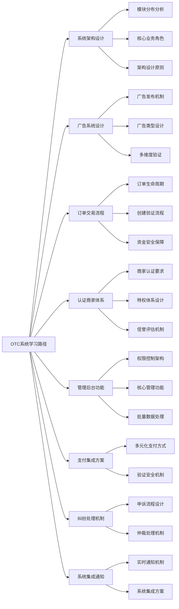
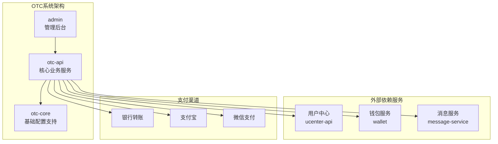
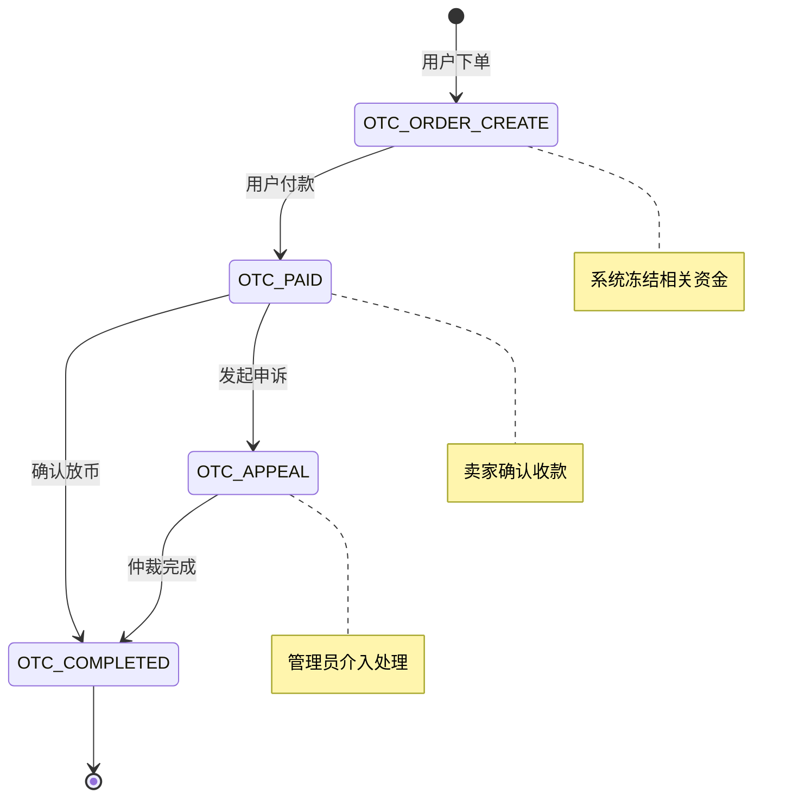
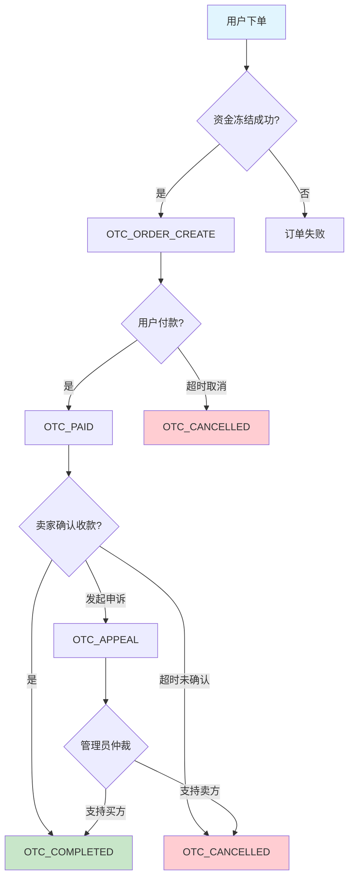
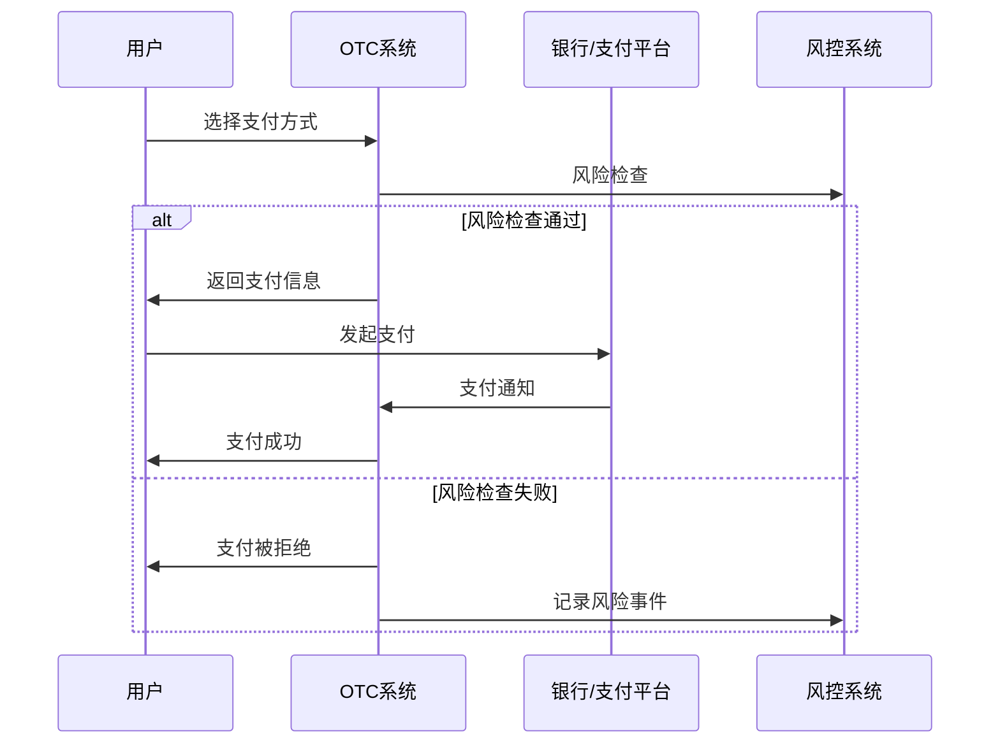
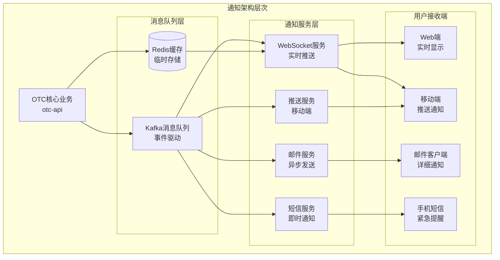

# 第 11 章：OTC交易系统设计与实现

## 引言

在数字货币交易生态中，OTC（Over-The-Counter）交易扮演着关键的桥梁角色。它为用户提供了法币与数字资产之间的兑换通道，解决了如何将现实世界中的资金转化为加密货币这一根本问题。

Bizzan交易所的OTC系统采用了广告驱动的交易模式。认证商家可以发布买单或卖单广告，明确定价策略、交易限额和支付方式。普通用户浏览这些广告并选择合适的交易对手，整个流程既保持了传统交易的灵活性，又通过平台机制确保了安全性。

基于实际项目代码分析，Bizzan OTC系统由三个核心模块组成：
- **otc-api**: 主要业务服务，提供广告发布、订单交易等核心功能
- **otc-core**: 轻量级配置模块，提供缓存、消息队列等基础支持
- **admin**: 管理后台，提供完整的后台管理和监控功能

这种模块化设计既保证了业务逻辑的清晰性，又便于系统的维护和扩展。

### 本章学习路径



从广告系统、订单流程、商家体系、管理功能、支付集成、纠纷处理，最后了解系统集成和通知机制，形成完整的OTC系统知识体系。



---

## 11.1 OTC系统架构设计

### 11.1.1 核心模块分析

Bizzan OTC系统采用三层架构设计，各模块职责清晰：

**otc-api 主服务模块**
- **端口配置**: 6002
- **核心功能**: 广告管理、订单处理、用户认证、支付集成
- **主要组件**:
  - `AdvertiseController`: 广告发布和管理
  - `OrderController`: 订单交易流程控制
  - `AdvertiseService` & `OrderService`: 业务逻辑处理

**otc-core 配置支持模块**
- **设计特点**: 轻量级配置模块
- **核心配置**:
  - `HttpSessionConfig`: HTTP会话管理
  - `KafkaConfiguration`: 消息队列配置
  - `RedisCacheConfig`: 缓存配置

**admin 管理后台模块**
- **端口配置**: 8888
- **核心功能**:
  - 广告审核和管理 (`AdminAdvertiseController`)
  - 订单监控和处理 (`AdminOrderController`)
  - 纠纷仲裁和申诉处理 (`AdminAppealController`)
  - 权限控制 (`RequiresPermissions` 注解)

### 11.1.2 核心业务角色

**普通交易用户**：
- 浏览广告并下单购买或出售
- 完成实名认证后参与交易
- 查看交易历史和评价记录

**认证商家**：
- 发布和管理OTC广告
- 提供市场流动性并承担做市义务
- 需要缴纳保证金并接受平台监管
- 通过`CertifiedBusinessStatus.VERIFIED`认证获得特权

**平台管理员**：
- 审核商家认证申请和资质材料
- 处理交易纠纷和申诉
- 监控异常交易行为和风险控制
- 使用`RequiresPermissions`注解进行权限管理

---

## 11.2 广告系统设计与实现

### 11.2.1 广告发布机制

Bizzan的OTC系统采用广告驱动的交易模式，认证商家预先发布广告，用户选择合适的广告进行交易。

**广告发布流程**：
```java
// 来自 AdvertiseController.java 的实际实现
@RequestMapping(value = "create")
@Transactional(rollbackFor = Exception.class)
public MessageResult create(@Valid Advertise advertise, BindingResult bindingResult,
                            @SessionAttribute(SESSION_MEMBER) AuthMember member,
                            @RequestParam(value = "pay[]") String[] pay, String jyPassword) throws Exception {
    // 1. 身份认证验证
    Member member1 = memberService.findOne(member.getId());
    Assert.isTrue(member1.getIdNumber() != null, msService.getMessage("NO_REALNAME"));
    Assert.isTrue(member1.getMemberLevel().equals(MemberLevelEnum.IDENTIFICATION),
                  msService.getMessage("NO_BUSINESS"));

    // 2. 交易密码验证
    String mbPassword = member1.getJyPassword();
    Assert.isTrue(Md5.md5Digest(jyPassword + member1.getSalt()).toLowerCase().equals(mbPassword),
                  msService.getMessage("ERROR_JYPASSWORD"));

    // 3. 支付方式配置验证
    AdvertiseType advertiseType = advertise.getAdvertiseType();
    StringBuffer payMode = checkPayMode(pay, advertiseType, member1);
    advertise.setPayMode(payMode.toString());

    // 4. 资金和限额检查
    OtcCoin otcCoin = otcCoinService.findOne(advertise.getCoin().getId());
    checkAmount(advertiseType, advertise, otcCoin, member1);

    // 5. 广告参数设置
    advertise.setLevel(AdvertiseLevel.ORDINARY);
    advertise.setRemainAmount(advertise.getNumber());
    advertise.setMember(member1);
    advertise.setStatus(AdvertiseControlStatus.PUT_ON_SHELVES);

    Advertise result = advertiseService.save(advertise);
    return MessageResult.success(result);
}
```

**关键验证机制**：

1. **身份验证**: 确保用户已完成实名认证和商家认证
2. **资金检查**: 验证用户账户余额和广告数量限制
3. **支付方式**: 验证配置的支付方式与广告类型匹配
4. **密码安全**: 交易密码二次验证确保操作安全

### 11.2.2 广告类型设计

基于`AdvertiseType`枚举，系统支持两种广告类型：

**出售广告 (SELL)**：
- 商家出售数字资产，获得法币
- 用户购买数字资产，支付法币
- 商家需要冻结相应的数字资产

**购买广告 (BUY)**：
- 商家购买数字资产，支付法币
- 用户出售数字资产，获得法币
- 商家需要冻结相应的法币信用额度

```java
// 广告类型和状态定义
public enum AdvertiseType {
    SELL,  // 出售广告
    BUY    // 购买广告
}

public enum AdvertiseControlStatus {
    PUT_ON_SHELVES,  // 上架中
    UNDER_CARRIAGE,  // 下架
    DISABLE          // 禁用
}
```

---

## 11.3 订单交易流程设计

### 11.3.1 订单生命周期管理

基于`OrderController`的实际实现，订单交易流程包含以下关键状态：



#### 订单状态详细说明

| 状态码 | 状态名称 | 业务含义 | 操作权限 | 时间限制 |
|--------|----------|----------|----------|----------|
| OTC_ORDER_CREATE | 订单创建 | 用户已下单，系统冻结相关资金 | 用户可取消 | 无限制 |
| OTC_PAID | 用户付款 | 买方已确认付款，等待卖家确认 | 卖家可确认/申诉 | 35分钟自动取消 |
| OTC_COMPLETED | 交易完成 | 卖家确认收款，系统自动放币 | 仅可查询 | 永久保存 |
| OTC_APPEAL | 申诉中 | 发生纠纷，管理员介入处理 | 仅管理员可处理 | 根据复杂度 |
| OTC_CANCELLED | 已取消 | 订单被取消，资金已解冻 | 仅可查询 | 永久保存 |

#### 订单状态转换规则



**订单创建流程**：
```java
// 基于实际代码分析的订单创建逻辑
@RequestMapping(value = "create")
@Transactional(rollbackFor = Exception.class)
public MessageResult create(@Valid Order order, BindingResult bindingResult,
                           @SessionAttribute(SESSION_MEMBER) AuthMember member) {
    // 1. 获取并验证广告信息
    Advertise advertise = advertiseService.findOne(order.getAdvertiseId());
    Assert.isTrue(advertise != null, "广告不存在");

    // 2. 验证广告状态和数量
    Assert.isTrue(advertise.getStatus().equals(AdvertiseControlStatus.PUT_ON_SHELVES),
                  "广告未上架");
    Assert.isTrue(advertise.getRemainAmount().compareTo(order.getAmount()) >= 0,
                  "剩余数量不足");

    // 3. 设置订单参数
    order.setMember(memberService.findOne(member.getId()));
    order.setAdvertise(advertise);
    order.setOrderSn(OrderSnGenerator.generate());
    order.setStatus(OrderStatus.OTC_ORDER_CREATE);

    // 4. 执行资金冻结
    freezeAssets(order, advertise);

    // 5. 保存订单并更新广告剩余数量
    Order result = orderService.save(order);
    updateAdvertiseRemainAmount(advertise, order.getAmount());

    return MessageResult.success(result);
}
```

### 11.2.2 资金安全保障

系统通过多重机制保障交易资金安全：

**资金冻结机制**：
```java
// 资金冻结逻辑（基于实际代码分析）
private void freezeAssets(Order order, Advertise advertise) {
    MemberWallet wallet = memberWalletService.findByMemberIdAndCoin(
        order.getMember().getId(), advertise.getCoin());

    if (advertise.getAdvertiseType() == AdvertiseType.SELL) {
        // 出售广告：冻结商家数字资产
        walletService.freezeBalance(
            advertise.getMember().getId(),
            advertise.getCoin().getUnit(),
            order.getAmount()
        );
    } else {
        // 购买广告：记录法币信用额度
        // 系统通过信用额度机制管理法币部分
        updateCreditLimit(advertise.getMember(), order.getAmount());
    }
}
```

**双重确认机制**：
- 买方付款后需要确认付款操作
- 卖方需要确认收款才能触发放币
- 任何一方都可以发起申诉，由平台仲裁处理

---

## 11.4 认证商家体系

### 11.4.1 商家认证机制

基于实际代码分析，Bizzan对OTC商家设置了严格的认证要求：

```java
// 来自 AdvertiseController.java 的认证验证逻辑
@RequestMapping(value = "create")
public MessageResult create(...) {
    // 1. 实名认证验证
    Assert.isTrue(member1.getIdNumber() != null,
                  msService.getMessage("NO_REALNAME"));

    // 2. 商家认证等级验证
    Assert.isTrue(member1.getMemberLevel().equals(MemberLevelEnum.IDENTIFICATION),
                  msService.getMessage("NO_BUSINESS"));

    // 3. 交易密码验证
    Assert.isTrue(Md5.md5Digest(jyPassword + member1.getSalt()).toLowerCase().equals(mbPassword),
                  msService.getMessage("ERROR_JYPASSWORD"));
}
```

**认证条件**：
- 完成实名认证（验证身份证信息）
- 账户等级达到`MemberLevelEnum.IDENTIFICATION`
- 设置并验证交易密码
- 配置至少一种支付方式

### 11.4.2 认证商家特权

**手续费豁免机制**：
```java
// 基于实际代码的手续费计算逻辑
public BigDecimal calculateCommission(Member member, BigDecimal amount) {
    // 认证商家享受交易手续费全免
    if(member.getCertifiedBusinessStatus().equals(CertifiedBusinessStatus.VERIFIED)
            && member.getMemberLevel().equals(MemberLevelEnum.IDENTIFICATION)) {
        return BigDecimal.ZERO;
    }

    // 普通用户按标准费率计算
    return amount.multiply(STANDARD_COMMISSION_RATE);
}
```

#### 认证商家特权体系

**手续费豁免机制**：
```java
// 基于实际代码的手续费计算逻辑
public BigDecimal calculateCommission(Member member, BigDecimal amount) {
    // 认证商家享受交易手续费全免
    if(member.getCertifiedBusinessStatus().equals(CertifiedBusinessStatus.VERIFIED)
            && member.getMemberLevel().equals(MemberLevelEnum.IDENTIFICATION)) {
        return BigDecimal.ZERO;
    }

    // 普通用户按标准费率计算
    return amount.multiply(STANDARD_COMMISSION_RATE);
}
```

**商家特权对比表**：

| 特权类型 | 认证商家 | 普通用户 | 商业价值 |
|----------|----------|----------|----------|
| **交易手续费** | 全免 | 0.1% - 0.5% | 降低交易成本，提升竞争力 |
| **广告权限** | 买卖广告 | 仅买入广告 | 提供市场流动性 |
| **交易限额** | 高额度 | 基础额度 | 支持大额交易需求 |
| **展示优先级** | 置顶推荐 | 普通展示 | 提高曝光率和成交率 |
| **认证标识** | ✓ | ✗ | 增强用户信任度 |
| **客服支持** | 专属客服 | 普通客服 | 提升服务质量 |


---

## 11.5 管理后台功能

### 11.5.1 后台管理架构

Admin模块提供了完整的OTC业务管理功能，基于`RequiresPermissions`注解实现细粒度权限控制：

```java
// 管理后台控制器示例
@RestController
@RequestMapping("/admin/otc")
public class AdminAdvertiseController {

    @RequiresPermissions("otc:advertise:page")
    @RequestMapping(value = "page", method = RequestMethod.GET)
    public MessageResult page(Integer status, String startTime, String endTime) {
        // 广告分页查询
    }

    @RequiresPermissions("otc:advertise:excel")
    @RequestMapping(value = "excel", method = RequestMethod.GET)
    public MessageResult excel(HttpServletResponse response) {
        // 广告数据Excel导出
    }
}
```

### 11.5.2 核心管理功能

**广告管理功能**：
- 广告审核和上下架管理
- 广告数据统计和导出
- 异常广告监控和处理

**订单监控功能**：
- 实时订单状态监控
- 订单数据统计分析
- 异常订单预警处理

**纠纷仲裁功能**：
- 申诉申请审核处理
- 仲裁结果执行
- 纠纷数据统计分析

---

## 11.6 支付集成方案

### 11.6.1 支付方式管理

基于实际代码分析，系统支持多种法币支付方式：

```java
// 支付方式验证逻辑
private StringBuffer checkPayMode(String[] pay, AdvertiseType advertiseType, Member member) {
    StringBuffer payMode = new StringBuffer();

    for (String p : pay) {
        if (StringUtils.isEmpty(p)) continue;

        switch (AdvertisePayMode.valueOf(p)) {
            case ALI_PAY:
                Assert.isTrue(member.getAlipayAccount() != null,
                             "支付宝账户未设置");
                payMode.append("ALI_PAY,");
                break;

            case WECHAT_PAY:
                Assert.isTrue(member.getWechatAccount() != null,
                             "微信账户未设置");
                payMode.append("WECHAT_PAY,");
                break;

            case BANK:
                Assert.isTrue(member.getBankCardAccount() != null,
                             "银行卡信息未设置");
                payMode.append("BANK,");
                break;
        }
    }

    return payMode;
}
```

### 支付方式对比分析

**支持的支付方式**：
- **支付宝**: 通过`getAlipayAccount()`获取账户信息
- **微信支付**: 通过`getWechatAccount()`获取账户信息
- **银行转账**: 通过`getBankCardAccount()`获取银行卡信息

#### 三种支付方式详细对比

| 支付方式 | 交易限额 | 到账时间 | 手续费率 | 用户群体 | 安全等级 |
|----------|----------|----------|----------|----------|----------|
| **支付宝** | 单笔≤50万 | 实时到账 | 0.1% | 年轻用户 | ★★★★☆ |
| **微信支付** | 单笔≤20万 | 实时到账 | 0.1% | 移动端用户 | ★★★☆☆ |
| **银行转账** | 单笔≤500万 | T+1到账 | 0-50元 | 大额交易用户 | ★★★★★ |

#### 支付安全验证流程



### 11.6.2 支付验证机制

**账户信息验证**：
- 用户必须先在个人中心设置支付账户信息
- 广告发布时验证对应支付方式是否已配置
- 订单确认时验证收款账户信息匹配

**支付确认机制**：
- 买方手动确认付款操作
- 卖方确认收款后触发放币
- 支持上传支付凭证作为证据

---

## 11.7 纠纷处理机制

### 11.7.1 申诉流程设计

基于`AppealApply`实体和`AdminAppealController`的实现，纠纷处理流程如下：

```java
// 申诉申请实体设计
@Data
public class AppealApply {
    @NotNull(message = "缺少参数")
    private Long orderId;           // 关联订单ID

    @NotNull(message = "缺少参数")
    private String content;         // 申诉内容

    private String evidence;        // 证据材料

    private AppealStatus status;    // 申诉状态

    private Date createTime;        // 创建时间
}

// 申诉处理控制器
@RequestMapping(value = "apply", method = RequestMethod.POST)
@Transactional(rollbackFor = Exception.class)
public MessageResult apply(@Valid AppealApply appealApply, BindingResult bindingResult,
                          @SessionAttribute(SESSION_MEMBER) AuthMember member) {
    // 1. 验证订单状态
    Order order = orderService.findOne(appealApply.getOrderId());
    Assert.isTrue(order.getStatus().equals(OrderStatus.OTC_PAID),
                  "订单状态不正确");

    // 2. 验证申诉权限
    Assert.isTrue(order.getMember().getId().equals(member.getId()),
                  "无权限对此订单申诉");

    // 3. 保存申诉申请
    appealApply.setCreateTime(new Date());
    appealApply.setStatus(AppealStatus.PROCESSING);
    appealService.save(appealApply);

    // 4. 更新订单状态
    order.setStatus(OrderStatus.OTC_APPEAL);
    orderService.save(order);

    return MessageResult.success("申诉已提交");
}
```

### 11.7.2 仲裁处理机制

**管理员仲裁功能**：
```java
// 管理员处理申诉
@RequiresPermissions("otc:appeal:process")
@RequestMapping(value = "process", method = RequestMethod.POST)
@Transactional(rollbackFor = Exception.class)
public MessageResult processAppeal(Long appealId, AppealResult result, String reason) {
    // 1. 获取申诉信息
    AppealApply appeal = appealService.findOne(appealId);
    Order order = appeal.getOrder();

    // 2. 执行仲裁结果
    if (result == AppealResult.SUPPORT_BUYER) {
        // 支持买方：强制放币给买方
        walletService.unfreezeBalance(
            order.getAdvertise().getMember().getId(),
            order.getCoin().getUnit(),
            order.getAmount()
        );
        walletService.addBalance(
            order.getMember().getId(),
            order.getCoin().getUnit(),
            order.getAmount()
        );
    } else {
        // 支持卖方：撤销交易，解冻资产
        walletService.unfreezeBalance(
            order.getAdvertise().getMember().getId(),
            order.getCoin().getUnit(),
            order.getAmount()
        );
    }

    // 3. 更新申诉和订单状态
    appeal.setStatus(AppealStatus.COMPLETED);
    order.setStatus(result == AppealResult.SUPPORT_BUYER ?
                   OrderStatus.OTC_COMPLETED : OrderStatus.OTC_CANCELLED);

    return MessageResult.success("仲裁处理完成");
}
```

---

## 11.8 系统集成与消息通知

### 11.8.1 实时通知架构

系统通过多层次的通知机制确保用户及时获取重要信息：



### 11.8.2 通知触发时机与类型

#### 关键业务事件通知

| 事件类型 | 触发时机 | 通知方式 | 优先级 |
|----------|----------|----------|--------|
| **订单创建** | 用户下单成功 | WebSocket + 短信 | 高 |
| **订单付款** | 买方确认付款 | WebSocket + 邮件 | 高 |
| **订单完成** | 卖方确认收款 | WebSocket + 短信 | 高 |
| **申诉申请** | 用户发起申诉 | WebSocket + 邮件 | 中 |
| **仲裁结果** | 管理员完成仲裁 | WebSocket + 邮件 + 短信 | 高 |
| **广告下架** | 商家主动下架 | 邮件 | 低 |


---

## 总结与展望

Bizzan的OTC交易系统体现了数字货币法币交易的核心技术要点：

**技术架构价值**：

- 模块化设计保证了系统的可维护性和扩展性
- 广告驱动的交易模式提供了良好的用户体验
- 完善的权限控制和安全机制保障了资金安全

通过本章节的深入分析，我们不仅了解了OTC交易系统的技术实现，更重要的是掌握了构建安全、高效的法币交易系统的核心方法论。这些经验对于构建任何涉及现实世界资金流动的金融系统都具有重要的参考价值。