# 第 12 章：CTC法币交易系统实战

## 引言

在数字货币交易所的完整业务体系中，CTC（Crypto to Cash）法币交易系统承担着连接数字资产与现实金融的重要职责。与OTC的点对点交易模式不同，CTC系统采用平台承兑模式，由交易所直接作为交易对手方，为用户提供更加稳定可靠的服务。

Bizzan的CTC系统被设计为官方的法币兑换通道，专注于USDT与人民币的交易。系统通过严格的用户认证、实时价格获取、多层验证机制和自动化处理，确保法币交易的安全性和可靠性。

### CTC vs OTC 法币交易模式对比

为了更好地理解CTC系统的设计定位和价值，我们将其与OTC系统进行全面对比：

| 对比维度 | CTC平台承兑模式 | OTC广告驱动模式 | 业务影响 |
|----------|----------------|-----------------|----------|
| **交易对手** | 交易所直接承兑 | 认证商家点对点交易 | CTC信任度更高，OTC选择更灵活 |
| **价格机制** | 实时获取市场汇率+固定差价 | 商家自主定价竞争 | CTC价格透明，OTC价格有竞争性 |
| **交易流程** | 标准化流程，快速成交 | 需等待匹配，流程较长 | CTC效率优先，OTC灵活性强 |
| **资金安全** | 平台直接担保，风险低 | 依赖商家信誉和平台仲裁 | CTC安全性高，OTC需风控机制 |
| **流动性** | 官方承兑，随时可交易 | 依赖商家在线状态 | CTC流动性稳定，OTC依赖商家 |
| **服务范围** | 仅支持USDT/CNY交易 | 支持多币种交易 | CTC专业化，OTC多样化 |
| **手续费** | 1.1%固定差价 | 认证商家免手续费 | CTC成本固定，OTC大额有优势 |
| **管理复杂度** | 集中管理，自动化程度高 | 需要商家管理和纠纷处理 | CTC运营简单，OTC管理复杂 |

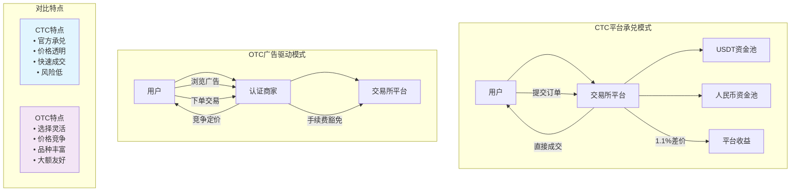

### 核心架构差异分析

#### CTC系统架构特点

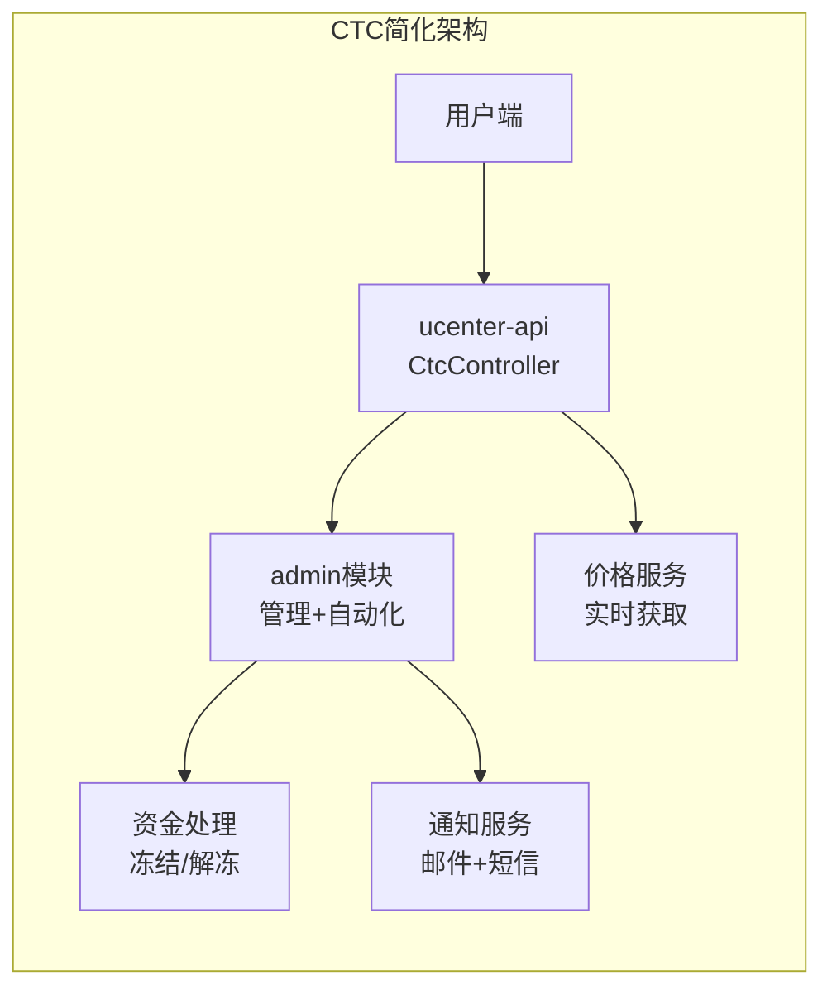

#### OTC系统架构特点

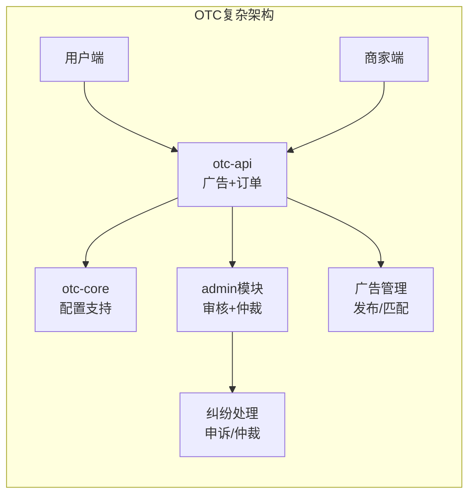

**架构复杂度对比**：
- **CTC**：模块简洁，职责清晰，主要由用户端和管理端两个部分组成
- **OTC**：模块复杂，涉及广告系统、商家管理、纠纷仲裁等多个子系统

基于对实际项目代码的深入分析，Bizzan CTC系统主要分布在ucenter-api和admin两个核心模块中：

- **ucenter-api模块**: 包含CtcController，负责用户端交易功能
- **admin模块**: 包含管理控制器和定时任务，负责后台管理和自动化处理

作为交易所技术体系的重要组成部分，CTC系统整合了多项核心技术：实时价格获取、短信验证码验证、订单状态管理、资产冻结解冻、自动化超时处理、管理员通知等。

### 本章学习路径

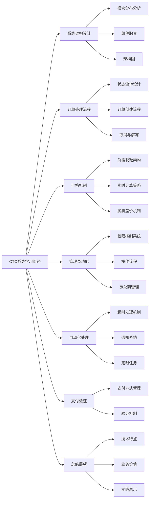

本章将深入解析Bizzan CTC系统的技术实现，重点关注平台承兑模式下的业务流程设计、风险控制机制和管理员操作流程。

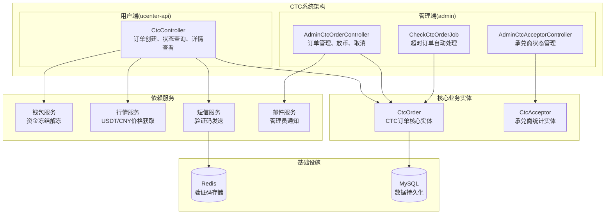

---

## 12.1 CTC系统架构设计

### 实际模块分布

基于对项目代码的深入分析，Bizzan CTC系统采用清晰的模块分离设计：

**ucenter-api模块 (核心用户服务)**：
- **端口**: 默认Spring Boot端口
- **核心控制器**: `CtcController`
- **主要功能**: 订单创建、查询、详情、取消、付款确认

**admin模块 (管理后台)**：
- **端口**: 8088
- **管理控制器**:
  - `AdminCtcOrderController`: 订单管理、放币、取消操作
  - `AdminCtcAcceptorController`: 承兑商状态管理
- **定时任务**: `CheckCtcOrderJob`: 超时订单自动处理

### 核心组件职责

**CtcController (用户端API)**：
负责处理用户的所有CTC交易请求，集成了完整的验证流程：

```java
@RestController
@RequestMapping("ctc")
public class CtcController extends BaseController {

    @Autowired
    private CtcOrderService ctcOrderService;

    @Autowired
    private CtcAcceptorService ctcAcceptorService;

    @Autowired
    private MemberWalletService memberWalletService;

    @Autowired
    private SMSProvider smsProvider;

    @Autowired
    private RestTemplate restTemplate;
}
```

**核心功能方法**：
- `page-query`: 查询用户订单列表
- `detail`: 获取订单详情
- `new-ctc-order`: 创建新订单（核心业务逻辑）
- `cancel-ctc-order`: 取消订单
- `pay-ctc-order`: 标记已付款

**CheckCtcOrderJob (自动化处理)**：
定时任务组件，每2分钟执行一次超时订单检查：

```java
@Component
@Slf4j
public class CheckCtcOrderJob {

    @Scheduled(cron = "0 */2 * * * *")
    public void checkIfHasExpiredOrder(){
        // 检查未接单订单（35分钟超时自动取消）
        // 检查已接单但未付款订单（35分钟超时自动取消）
    }
}
```

**AdminCtcOrderController (管理员操作)**：
提供完整的订单管理功能，包括管理员密码验证：

```java
@RestController
@RequestMapping("/ctc/order")
public class AdminCtcOrderController extends BaseController {

    @RequiresPermissions("ctc:order:page-query")
    @PostMapping("page-query")
    public MessageResult orderList(PageModel pageModel) {}

    @RequiresPermissions("ctc:order:complete-order")
    @PostMapping("complete-order")
    public MessageResult completeOrder(@RequestParam("id") Long id,
                                       @RequestParam(value = "password") String password) {}
}
```

---

## 12.2 CTC订单处理流程

### 实际订单状态流转

基于实际代码分析，CTC订单的状态流转与OTC系统有显著区别：

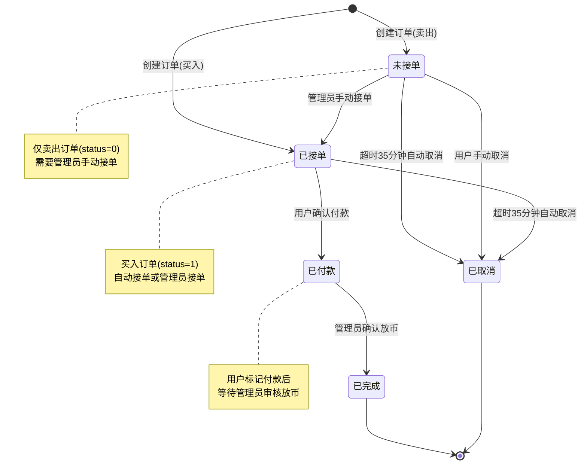

**状态码定义（基于实际代码）**：
- **0 - 未接单**: 仅适用于卖出订单，等待管理员接单
- **1 - 已接单**: 订单已确认，等待用户付款
- **2 - 已付款**: 用户已确认付款，等待管理员放币
- **3 - 已完成**: 交易完成，资金已划转
- **4 - 已取消**: 订单取消，资金已解冻

### 订单创建流程详解

基于`CtcController.add`方法的实际实现，订单创建流程是一个严谨的多步骤验证和处理过程。系统通过层层验证确保交易安全，同时通过实时价格获取保证价格公平性。

#### 完整订单创建流程

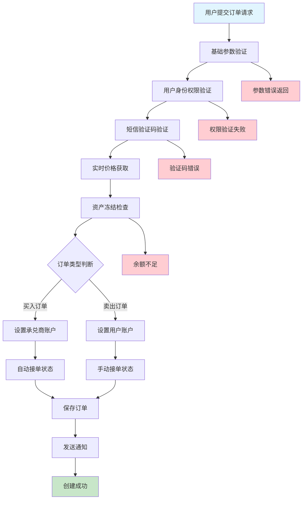

**1. 基础参数验证**

订单创建的第一道防线是基础参数验证，确保输入数据的有效性和合理性：

```java
@RequestMapping("new-ctc-order")
@Transactional(rollbackFor = Exception.class)
public MessageResult add(@SessionAttribute(SESSION_MEMBER) AuthMember authMember,
                         BigDecimal price, BigDecimal amount, String payType,
                         Integer direction, String unit, String fundpwd, String code) {

    // 支付方式验证
    if(!payType.equals("alipay") && !payType.equals("bank") && !payType.equals("wechatpay")) {
        return error("请选择正确的付款/收款方式");
    }

    // 交易数量限制
    if(amount.compareTo(new BigDecimal(50)) < 0) {
        return error("买入/卖出数量不能低于50");
    }
    if(amount.compareTo(new BigDecimal(50000)) > 0) {
        return error("买入/卖出数量不能高于50000");
    }
}

**验证规则说明**：
- **支付方式限制**：仅支持支付宝、银行转账、微信支付三种主流支付方式
- **最小交易量**：50 USDT起步，防止过于零碎的交易
- **最大交易量**：50,000 USDT上限，控制单笔交易风险
- **参数有效性**：确保所有必需参数都已提供且格式正确
```

**2. 用户身份和权限验证**
```java
// 检查用户账户是否可交易
Member member = memberService.findOne(authMember.getId());
if(member.getMemberLevel() == MemberLevelEnum.GENERAL) {
    return error("请先进行实名认证");
}

// 是否被禁止交易
if(member.getTransactionStatus().equals(BooleanEnum.IS_FALSE)) {
    return error("您的账户无法进行交易");
}

// 实名认证检查
hasText(member.getIdNumber(), sourceService.getMessage("NO_REAL_NAME"));
// 资产密码检查
hasText(member.getJyPassword(), sourceService.getMessage("NO_JY_PASSWORD"));
```

**3. 短信验证码验证（关键安全机制）**

短信验证码是CTC交易系统的核心安全机制，通过Redis存储和验证确保操作的安全性：

#### 短信验证码流程

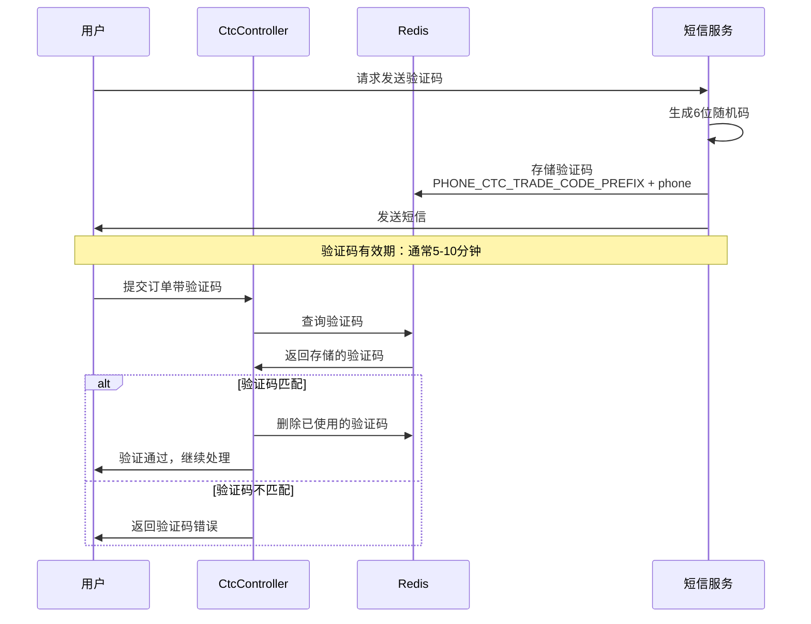

```java
// 短信验证码验证
ValueOperations valueOperations = redisTemplate.opsForValue();
String phone = member.getMobilePhone();
Object codeRedis = valueOperations.get(SysConstant.PHONE_CTC_TRADE_CODE_PREFIX + phone);
notNull(codeRedis, sourceService.getMessage("VERIFICATION_CODE_NOT_EXISTS"));
if (!codeRedis.toString().equals(code)) {
    return error(sourceService.getMessage("VERIFICATION_CODE_INCORRECT"));
} else {
    valueOperations.getOperations().delete(SysConstant.PHONE_CTC_TRADE_CODE_PREFIX + phone);
}
```

**安全机制详解**：

- **存储键设计**：使用`PHONE_CTC_TRADE_CODE_PREFIX + phone`作为Redis键，确保每个用户的验证码独立存储
- **一次性使用**：验证成功后立即删除验证码，防止重复使用
- **有效期控制**：Redis设置TTL，验证码自动过期
- **错误处理**：明确区分验证码不存在和验证码错误两种情况
- **防暴力破解**：通过限制验证码发送频率和尝试次数，提高安全性

**4. 实时价格获取机制**

CTC系统采用实时价格获取机制，确保用户能够获得公平合理的交易价格。系统通过与市场服务集成，实时获取USDT/CNY汇率，并在此基础上计算合理的买卖价格。

#### 实时价格获取流程

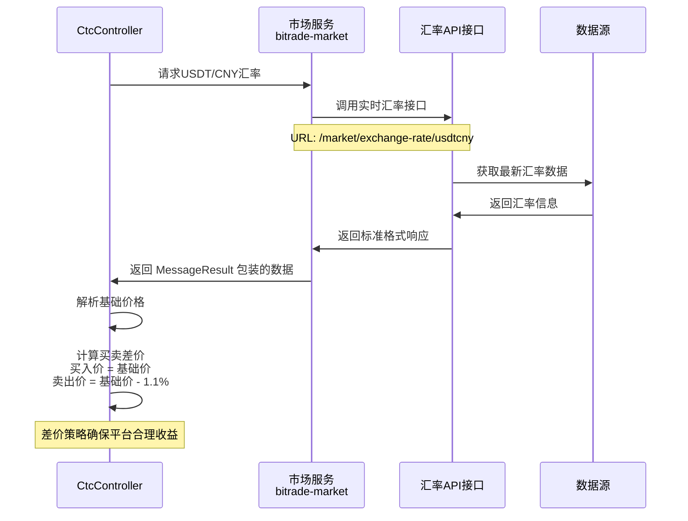

```java
// 获取USDT价格,设置买入/卖出价格
String url = "http://bitrade-market/market/exchange-rate/usdtcny";
ResponseEntity<MessageResult> result = restTemplate.getForEntity(url, MessageResult.class);
if (result.getStatusCode().value() == 200 && result.getBody().getCode() == 0) {
    BigDecimal buyPrice = new BigDecimal((String) result.getBody().getData());
    BigDecimal sellPrice = buyPrice.subtract(buyPrice.multiply(new BigDecimal(0.011)).setScale(2, BigDecimal.ROUND_DOWN));

    if(direction.intValue() == 0) {
        // 买入 - 使用买入价格
        order.setPrice(buyPrice);
    } else {
        // 卖出 - 使用卖出价格（买入价-1.1%）
        order.setPrice(sellPrice);
    }
}
```

**价格机制详解**：

- **价格来源**：从`bitrade-market`服务实时获取USDT/CNY汇率
- **基础价格**：以市场服务的实时汇率为基准价格
- **买卖差价**：
  - **买入价格**：直接使用基础价格（用户用CNY买USDT）
  - **卖出价格**：基础价格减去1.1%（用户卖USDT换CNY）
  - **差价目的**：为平台提供合理的服务费收益
- **精度控制**：使用`setScale(2, BigDecimal.ROUND_DOWN)`确保价格精度和一致性

**价格策略的优势**：
- **实时性**：每次订单创建都获取最新价格，确保价格公平
- **透明性**：明确的差价计算规则，用户可理解
- **稳定性**：通过合理的差价设计，保障平台可持续运营
- **竞争力**：1.1%的差价在行业内具有竞争优势

**5. 资产冻结处理**
```java
// 卖出时冻结用户资产
if(direction.intValue() == 1) {
    // 检查余额是否足够
    isTrue(compare(memberWallet.getBalance(), amount), sourceService.getMessage("INSUFFICIENT_BALANCE"));
}

// =====================卖出冻结资产==================== //
if(direction.intValue() == 1) {
    memberWalletService.freezeBalance(memberWallet, amount);
}
```

**6. 支付方式信息设置**
```java
// 设置付款/收款账户信息
if(direction.intValue() == 0) {
    // 买入，设置为承兑商账户信息
    if(payType.equals("alipay")) {
        if(acceptors.get(0).getMember().getAlipay() == null) {
            return error("承兑商暂不支持支付宝");
        }
        order.setAlipay(acceptors.get(0).getMember().getAlipay());
    }
    order.setStatus(1); // 买入自动接单
    order.setConfirmTime(DateUtil.getCurrentDate());
}
if(direction.intValue() == 1) {
    // 卖出，设置为用户账户信息
    if(payType.equals("alipay")) {
        if(member.getAlipay() == null) {
            return error("您尚未绑定支付宝账户信息！");
        }
        order.setAlipay(member.getAlipay());
    }
    order.setStatus(0); // 卖出，设置为手动接单
}
```

### 订单取消与资产解冻

基于`CtcController.cancelOrder`方法，订单取消流程包含资产解冻逻辑：

```java
@RequestMapping("cancel-ctc-order")
@Transactional(rollbackFor = Exception.class)
public MessageResult cancelOrder(@SessionAttribute(SESSION_MEMBER) AuthMember authMember, Long oid) {

    // 验证订单所有权和状态
    if(order.getStatus() != 0) {
        // 买入且状态为已接单（用户有权撤销订单）
        if(order.getDirection() == 0 && order.getStatus() == 1) {
            order.setStatus(4); // 撤销状态
            order.setCancelReason("用户自主取消");
            order.setCancelTime(DateUtil.getCurrentDate());
        }
    }

    if(order.getDirection() == 1) {
        //解冻资产（仅卖出订单需要解冻）
        MemberWallet memberWallet = memberWalletService.findByCoinUnitAndMemberId(order.getUnit(), member.getId());
        if(memberWallet.getFrozenBalance().compareTo(order.getAmount()) < 0) {
            return error("无法撤销，无法解冻资产误！");
        }
        memberWalletService.thawBalance(memberWallet, order.getAmount());
    }
}
```

---

## 12.3 价格机制与实时获取

### 价格获取架构

CTC系统的价格机制采用了实时获取的方式，确保价格的准确性和时效性：

```java
// 核心价格获取逻辑
String url = "http://bitrade-market/market/exchange-rate/usdtcny";
ResponseEntity<MessageResult> result = restTemplate.getForEntity(url, MessageResult.class);
```

### 价格计算策略

系统采用了买卖差价策略，为平台提供合理的利润空间：

**买入价格**: 直接从市场服务获取的USDT/CNY价格
**卖出价格**: 买入价格减去1.1%的差价

```java
BigDecimal buyPrice = new BigDecimal((String) result.getBody().getData());
BigDecimal sellPrice = buyPrice.subtract(buyPrice.multiply(new BigDecimal(0.011)).setScale(2, BigDecimal.ROUND_DOWN));
```

**差价计算公式**:
```
卖出价格 = 买入价格 × (1 - 0.011)
```

这种设计确保了：
- 价格的实时性和准确性
- 平台合理的利润空间（1.1%）
- 买卖价格的公平性

---

## 12.4 管理员功能与权限控制

### 管理员操作流程

基于`AdminCtcOrderController`的实际实现，管理员功能包含完整的权限控制机制：

**权限验证**：
```java
@RequiresPermissions("ctc:order:confirm-order")
@PostMapping("confirm-order")
@Transactional(rollbackFor = Exception.class)
public MessageResult confirmOrder(@RequestParam("id") Long id,
                                 @RequestParam(value = "password") String password,
                                 @SessionAttribute(SysConstant.SESSION_ADMIN) Admin admin) {

    // 管理员密码验证
    password = Encrypt.MD5(password + md5Key);
    Assert.isTrue(password.equals(admin.getPassword()), messageSource.getMessage("WRONG_PASSWORD"));

    // 执行接单逻辑
    CtcOrder order = ctcOrderService.findOne(id);
    if(order.getStatus() != 0) {
        return error("无法对未接单状态之外的状态订单进行接单");
    }
    order.setStatus(1);
    order.setConfirmTime(DateUtil.getCurrentDate());
    ctcOrderService.save(order);
}
```

### 放币操作详解

**买入订单放币（用户获得USDT）**：
```java
if(order.getDirection() == 0) {
    // 增加用户钱包余额
    MemberWallet mw = memberWalletService.findByCoinUnitAndMemberId(order.getUnit(), order.getMember().getId());
    memberWalletService.increaseBalance(mw.getId(), order.getAmount());

    // 记录交易流水
    MemberTransaction memberTransaction = new MemberTransaction();
    memberTransaction.setFee(BigDecimal.ZERO);
    memberTransaction.setAmount(order.getAmount());
    memberTransaction.setMemberId(mw.getMemberId());
    memberTransaction.setSymbol(order.getUnit());
    memberTransaction.setType(TransactionType.CTC_BUY);
    memberTransactionService.save(memberTransaction);
}
```

**卖出订单放币（用户获得法币，解冻USDT）**：
```java
if(order.getDirection() == 1) {
    // 解冻用户资产
    MemberWallet mw = memberWalletService.findByCoinUnitAndMemberId(order.getUnit(), order.getMember().getId());
    memberWalletService.decreaseFrozen(mw.getId(), order.getAmount());

    // 记录交易流水
    MemberTransaction memberTransaction = new MemberTransaction();
    memberTransaction.setAmount(order.getAmount().negate()); // 负数表示减少
    memberTransaction.setType(TransactionType.CTC_SELL);
    memberTransactionService.save(memberTransaction);
}
```

### 承兑商统计管理

基于`CtcAcceptor`实体，系统维护承兑商的交易统计数据：

```java
// 买入场景=>承兑商统计更新
if(order.getDirection() == 0) {
    acceptor.setUsdtOut(acceptor.getUsdtOut().add(order.getAmount())); // 售出USDT增加
    acceptor.setCnyIn(acceptor.getCnyIn().add(order.getMoney()));   // 人民币收入增加
}

// 卖出场景=>承兑商统计更新
if(order.getDirection() == 1) {
    acceptor.setUsdtIn(acceptor.getUsdtIn().add(order.getAmount()));   // 入账USDT增加
    acceptor.setCnyOut(acceptor.getCnyOut().add(order.getMoney())); // 人民币付出增加
}
```

---

## 12.5 自动化处理与通知机制

CTC系统通过自动化处理机制确保交易流程的顺畅进行，防止订单长期处于异常状态。系统每2分钟执行一次全面检查，及时处理超时订单，同时通过多渠道通知机制确保管理员能够及时响应用户操作。

### 超时订单自动处理

基于`CheckCtcOrderJob`的实际实现，系统通过定时任务实现订单的全生命周期管理。

#### 自动化处理架构

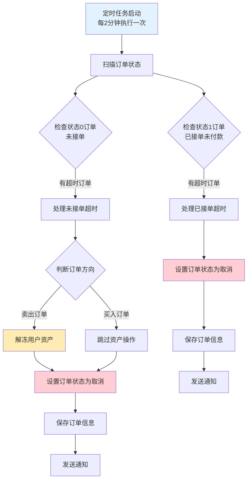

**超时时间设定**：35分钟（2,100,000毫秒）

```java
@Scheduled(cron = "0 */2 * * * *")
public void checkIfHasExpiredOrder(){
    List<CtcOrder> orderList0 = ctcOrderService.findAllByStatus(0); // 未接单订单
    List<CtcOrder> orderList1 = ctcOrderService.findAllByStatus(1); // 已接单订单

    Date currentDate = DateUtil.getCurrentDate();

    // 检查未接单订单超时
    for(CtcOrder order : orderList0) {
        // 超时35分钟自动取消
        if(currentDate.getTime() - order.getCreateTime().getTime() > 2100000) {
            if(order.getDirection() == 1) {
                // 仅卖出时解冻用户资产
                memberWalletService.thawBalance(memberWallet, order.getAmount());
            }
            order.setStatus(4);
            order.setCancelReason("超时系统自动取消");
            ctcOrderService.saveAndFlush(order);
        }
    }

    // 检查已接单但未付款订单超时
    for(CtcOrder order : orderList1) {
        if(order.getStatus() == 1 && order.getDirection() == 0) {
            if(currentDate.getTime() - order.getConfirmTime().getTime() > 2100000) {
                order.setStatus(4);
                order.setCancelReason("超时系统自动取消");
                ctcOrderService.saveAndFlush(order);
            }
        }
    }
}
```

**自动化处理策略详解**：

- **检查频率**：每2分钟执行一次，确保及时处理
- **超时阈值**：35分钟，给用户充足的反应时间
- **状态0处理**：未接单订单超时，卖出订单需要解冻资产
- **状态1处理**：仅针对买入订单，防止用户下单后忘记付款
- **资产安全**：所有资产操作都有事务保护，确保数据一致性
```

### 管理员通知机制

CTC系统设计了完善的多层通知机制，确保管理员能够及时响应关键业务操作。当用户标记付款后，系统会自动触发通知流程，通过邮件和短信两种渠道确保消息的及时送达。

#### 管理员通知流程

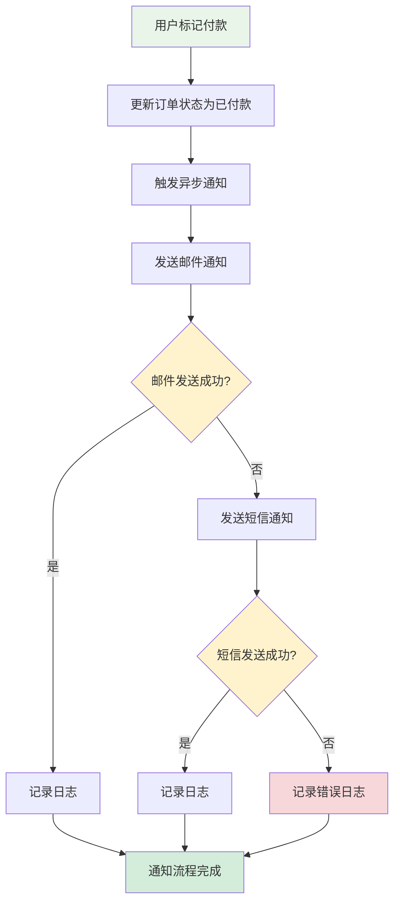

#### 通知机制实现

```java
@RequestMapping("pay-ctc-order")
@Transactional(rollbackFor = Exception.class)
public MessageResult payOrder(@SessionAttribute(SESSION_MEMBER) AuthMember authMember, Long oid) throws Exception {

    // 标记付款状态
    order.setStatus(2); // 已付款
    order.setPayTime(DateUtil.getCurrentDate());
    CtcOrder orderResult = ctcOrderService.saveAndFlush(order);

    // 发送管理员通知
    sendNotification();

    return success(orderResult);
}

@Async
private void sendNotification() {
    try {
        String[] adminList = admins.split(",");
        for(int i = 0; i < adminList.length; i++) {
            sendEmailMsg(adminList[i], "收到用户付款标记", "用户付款通知");
        }
    } catch (Exception e) {
        // 邮件发送失败，尝试短信通知
        try {
            String[] phones = adminPhones.split(",");
            if(phones.length > 0) {
                smsProvider.sendSingleMessage(phones[0], "收到用户付款标记");
            }
        } catch (Exception e1) {
            e1.printStackTrace();
        }
    }
}
```

**通知机制特点**：

- **异步处理**：使用`@Async`注解，避免阻塞主业务流程
- **多重保障**：邮件失败时自动切换短信通知
- **批量通知**：支持多个管理员的批量通知
- **错误处理**：完善的异常处理和错误记录
- **实时性**：用户付款后立即触发通知，确保及时响应

#### 通知渠道设计

**邮件通知**：
- 适用于详细信息传递
- 可包含订单详情、用户信息等
- 便于记录和存档

**短信通知**：
- 适用于紧急消息推送
- 确保消息及时触达
- 作为邮件通知的备份渠道


## 总结与展望

Bizzan的CTC法币交易系统是平台承兑模式的典型实现，通过深入分析其技术架构和业务流程，我们可以总结出完整的系统设计理念和工程实践价值。

### CTC系统完整架构总览

```mermaid
graph TB
    subgraph "用户端 ucenter-api"
        CTC_CTRL[CtcController<br/>订单创建、查询、取消、付款确认]
    end

    subgraph "管理端 admin"
        ADMIN_ORDER[AdminCtcOrderController<br/>订单管理、接单、放币]
        ADMIN_ACCEPTOR[AdminCtcAcceptorController<br/>承兑商管理]
        TIMER_JOB[CheckCtcOrderJob<br/>定时任务、超时处理]
    end

    subgraph "核心业务流程"
        ORDER_MGMT[订单状态管理<br/>0-4状态流转]
        ASSET_MGMT[资产冻结管理<br/>卖出订单冻结、解冻]
        PRICE_ENGINE[实时价格引擎<br/>USDT/CNY汇率获取]
    end

    subgraph "安全验证体系"
        SMS_VERIFY[短信验证码<br/>Redis存储、一次性使用]
        USER_AUTH[用户权限验证<br/>实名认证、交易密码]
        ADMIN_PERM[管理员权限<br/>@RequiresPermissions控制]
    end

    subgraph "通知机制"
        USER_SMS[用户短信通知<br/>订单状态变更提醒]
        ADMIN_NOTIFY[管理员通知<br/>邮件+短信双重保障]
    end

    subgraph "外部依赖服务"
        MARKET_API[市场服务API<br/>实时汇率获取]
        WALLET_SVC[钱包服务<br/>资产冻结解冻]
        SMS_SVC[短信服务<br/>验证码和通知发送]
        REDIS[(Redis缓存<br/>验证码存储)]
        MYSQL[(MySQL数据库<br/>订单持久化)]
    end

    CTC_CTRL --> ORDER_MGMT
    CTC_CTRL --> ASSET_MGMT
    CTC_CTRL --> PRICE_ENGINE
    CTC_CTRL --> SMS_VERIFY
    CTC_CTRL --> USER_AUTH

    ADMIN_ORDER --> ADMIN_PERM
    ADMIN_ORDER --> ORDER_MGMT
    ADMIN_ORDER --> ASSET_MGMT
    ADMIN_ORDER --> ADMIN_NOTIFY

    TIMER_JOB --> ORDER_MGMT
    TIMER_JOB --> ASSET_MGMT

    ORDER_MGMT --> USER_SMS
    ORDER_MGMT --> ADMIN_NOTIFY

    PRICE_ENGINE --> MARKET_API
    ASSET_MGMT --> WALLET_SVC
    SMS_VERIFY --> SMS_SVC
    SMS_VERIFY --> REDIS

    ORDER_MGMT --> MYSQL
    CTC_CTRL --> MYSQL
    ADMIN_ORDER --> MYSQL
```


通过CTC系统的深入学习，我们不仅掌握了法币交易系统的核心技术实现，更重要的是理解了如何在复杂的业务需求和技术约束之间找到最佳平衡点。这些经验对于构建任何涉及现实资金流动的金融系统都具有重要的参考价值，也为数字货币交易所的完整技术栈建设提供了坚实的理论基础和实践指导。